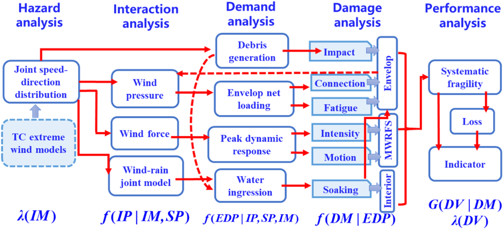
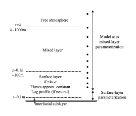
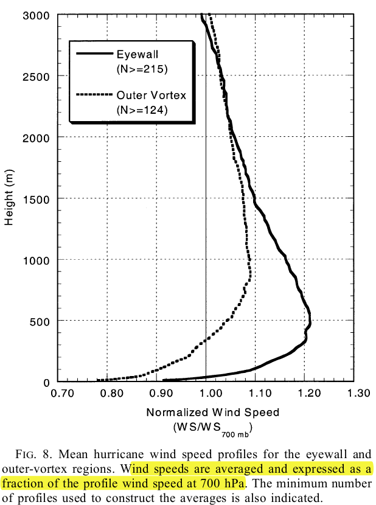

# Introduction

Tropical cyclones (TCs, hurricanes/typhoons/cyclones) can generate extreme near-surface wind speeds that pose severe hazards to the built environment. These extreme winds threaten civil engineering structures (such as low-rise and high-rise buildings, long-span bridges, wind turbines, and transmission tower-line systems). Combined with TC-induced secondary hazards (e.g., storm surge, flooding, and widespread power outages), TCs often result in devastating socioeconomic impacts. For example, Category 5 Hurricane Katrina (2005), with a maximum sustained wind speed of approximately 280 km/h, struck the United States, causing about \$125 billion in economic loss and 1392 fatalities ([Wikipedia 2025](#ref-wikipedia-2025)). More recently, the 2024 Atlantic hurricane season produced \$232.27 billion in economic losses, making it the second-costliest season on record ([Wikipedia 2025](#ref-wikipedia-2025)).

In regions prone to tropical cyclones, mitigating these hazards requires accurate prediction of TC-induced structural damage, a task commonly achieved through simulation-based performance-based wind engineering (PBWE). A core component of PBWE is the hazard analysis module, which demands reliable characterization of the tropical cyclone boundary layer (TCBL), where civil structures reside and experience the most severe wind conditions. Consequently, robust modeling of the TCBL is essential for providing input wind fields to PBWE and for improving risk-informed decision-making for infrastructure in TC-prone regions. A detailed overview of TCBL modeling is thus offered in this study.

In this regard, this section begins with a summary of the PBWE in Sec. [1.1](#performance-based-wind-engineering-pbwe), from which the need for the Monte Carlo simulation of TC events stems. This need also extends to the determination of design wind speeds in TC-prone regions. The simulation of TC events is commonly achieved through a multi-scale TC simulation procedure, outlined in Sec. [1.2](#multi-scale-simulation-of-tropical-cyclones), which highlights the central role of modeling the TCBL. The TCBL\'s definition and fundamental concepts are subsequently introduced in Sec. [1.3](#definition-of-tcbl) and Sec. [1.4](#recent-research-on-tcbl-characteristics), respectively. Building on these foundations, Sec. [1.5](#introduction-to-tcbl-modeling) summarizes and categorizes existing methods for modeling the TCBL within the multi-scale simulation framework used in PBWE. A detailed review of each category of TCBL modeling approaches is then provided in later sections, following the organization presented in Sec. [1.6](#organization-of-this-paper).

## Performance-based wind engineering (PBWE)

If the TC-induced damage to a structure can be predicted with sufficient accuracy, the structure can then be designed appropriately or retrofitted to withstand TC hazards throughout its life cycle or to recover with adequate resilience. Because this damage prediction is inherently uncertain, it must be assessed probabilistically, and the resulting fragility, vulnerability, risk, and loss estimates can subsequently inform wind-resistant design. To support such assessments, performance-based wind engineering (PBWE) has been developed as a rigorous, module-based simulation framework ([Ciampoli et al. 2011](#ref-ciampoli-2011); [Barbato et al. 2013](#ref-barbato-2013); [Spence and Kareem 2014](#ref-spence-2014); [Vanmarcke et al. 2014](#ref-vanmarcke-2014); [Cai et al. 2019](#ref-cai-2019)) and facilitates optimization of wind-resistant design of structures ([Huang et al. 2012](#ref-huang-2012); [Bobby et al. 2014](#ref-bobby-2014); [Li and Hu 2014](#ref-li-2014); [Deng et al. 2019](#ref-deng-2019); [Subgranon and Spence 2021](#ref-subgranon-2021); [Spence and Arunachalam 2022](#ref-spence-2022)). Although various other methods have been proposed for PBWE, including empirical and heuristic approaches ([Walker 2011](#ref-walker-2011); [Pita et al. 2014](#ref-pita-2014)), the simulation-based PBWE offers the capability to capture structural performance with high fidelity and provides the flexibility to incorporate cutting-edge developments in individual modules. [Figure 1](#fig-pbwe) shows a typical schematic of the PBWE framework for low-rise buildings.

::: {#fig-pbwe}
{width=100%}

A typical schematic of the simulation-based PBWE framework for low-rise buildings under TC-induced winds
:::

The PBWE framework aims to evaluate the total probabilistic integral:

$$
G(PI) = \int \int \int \int G(PI \mid DM) f(DM \mid EDP) f(EDP \mid IP, SP, IM) f(IP \mid IM, SP) \, d\lambda(IM)
$$ {#eq-1}

where the complementary cumulative distribution $G(PI)$ of performance indicator (PI, e.g., loss) is defined in terms of a series of conditional probabilistic distribution functions; DM, EDP, IP, and SP denote the parameters of damage, engineering demanding (e.g., wind-induced structural response), wind-structure interaction (e.g., wind pressure coefficients), and structural properties, respectively; $\lambda(IM)$ is the probabilistic distribution function of hazard intensity measure, usually represented by the joint distribution of wind speed and direction. In the simulation-based PBWE, Eq. (@eq-1) is commonly solved by the Monte Carlo method. An ensemble of TC wind samples is generated based on the statistics of TC characteristics (i.e., the TC simulation). Combined with sampled realizations of DM, EDP, IP, and SP, this ensemble yields a corresponding set of PI samples. Statistical evaluation of these samples provides estimates of the probabilistic characteristics required for PBWE. In addition, the probability distribution $\lambda(IM)$ can be estimated directly from the statistics of the simulated TC samples.

The accuracy of the intensity measure $\lambda(IM)$ obtained from simulated TC events is therefore essential not only for producing reliable PBWE results but also for establishing confidence among its end users. However, validating PBWE outcomes remains substantially challenging, if not impossible, primarily due to the absence of robust, universally accepted benchmarks. Consequently, to ensure that PBWE delivers trustworthy and actionable information, a common practice is to validate and refine each framework module to the greatest extent feasible.

Unlike traditional prescriptive wind-resistant design, which typically relies on conservative values, PBWE requires its probabilistic models to reflect real-world behavior as faithfully as possible. As indicated in Eq. (@eq-1) and [Figure 1](#fig-pbwe), the intensity measure $\lambda(IM)$serves as the foundational input to the entire PBWE framework and therefore has a profound influence on its results. For structures located in TC-prone regions, this measure is governed by TC-induced extreme winds. Accordingly, the TC simulation to determine the intensity measure is critical, as its accuracy is essential to the PBWE. The TC simulation module must therefore be thoroughly evaluated, adapted, and enhanced to enable a paradigm shift from traditional wind engineering practices toward the more comprehensive and probabilistic philosophy of PBWE.

.

## Multi-scale simulation of tropical cyclones

In PBWE, the TC simulation spans multiple spatial and temporal scales and must therefore be implemented within a multi-scale framework derived from current practice.

(1) **Climate scale.** Horizontal spatial scale: global; Temporal scale: months, seasons, years. This scale considers climate variability and potential climate change. It initializes TC events based on statistical descriptions of generation frequency, genesis location, initial intensity, and related parameters.
(2) **Macroscale.** Horizontal spatial scale: \~1000km; Temporal scale: several days covering the full lifecycle of a TC from genesis to decay. After a feasible TC event is generated, it evolves and translates toward landfall. This scale focuses on the evolution of TC statistics, including translation and intensity. TC track models are typical statistical tools used at this scale.
(3) **Mesoscale.** Horizontal spatial scale: \~100km; Temporal scale: several hours. At a specific location and time, the detailed TC structure can be resolved with grid sizes on the order of kilometers. The widely used WRF model and the TCBL models reviewed in this study operate at this scale.
(4) **Microscale.** Horizontal spatial scale: \~1km to 100m; Temporal scale: hours to minutes. At this scale, the TC wind field is refined to account for local terrain and to represent the wind acting on and flowing around buildings for wind-structure interaction analyses. This refinement can be achieved through WRF-LES (large-eddy simulation), but in most engineering applications, it is accomplished using terrain-dependent coefficients, such as gust factors and roughness length.

Note that this framework reflects the current practice of TC simulation used in wind engineering and is aligned with the meteorological scale system proposed by [Orlanski (1975)](#ref-orlanski-1975). A typical TC Monte Carlo simulation for PBWE must cover all of these scales, although simplifications and approximations at different levels may be applied. For example, in the simulation based on the circular sub-region method (CSM) ([Georgiou 1985](#ref-georgiou-1985)), the statistics of TC events at a specified location are first utilized to generate a TC passing through that location, covering the first two scales. The resulting TC event sample is characterized by parameters such as central pressure deficiency, translation speed, and heading. These parameters are then used to generate surface wind fields through a TCBL model. This process completes the mesoscale component of the simulation, and the resulting wind fields are further adjusted to local gust wind speeds (microscale) to determine the design wind speed. Research on TC simulation may focus on a single scale or couple multiple scales to capture specific physical interactions. It is important to note that all civil engineering structures are situated within the TCBL. Based on the multi-scale framework described above, the mesoscale modeling of the TCBL is an essential part of TC simulation and therefore plays a critical role within PBWE. Although the interaction of the TCBL with other scales is meaningful and can be incorporated when needed, this study focuses on the mesoscale TCBL modeling in relative isolation from other scales.

## Definition of TCBL

Vertically, a TC model spans the full depth of the atmosphere from the surface to the top of the free atmosphere ([Figure 2](#fig-tcbl-definition)). However, the TCBL in this study corresponds to the lowest portion of the troposphere, where viscosity plays a significant role and therefore cannot be neglected. Within the lowest approximately 10 cm above the surface, the interfacial sublayer, molecular constraints dominate momentum exchange ([Liu et al. 1979](#ref-liu-1979)). From the top of this sublayer to roughly 200 m is the flux-constant surface layer, where the shear-generated turbulence is the principal driver of turbulent diffusivity and the fluxes of momentum and heat remain constant. Above the flux-constant layer and extending to the top of the TCBL is the mixed layer, where the influence of the surface and turbulence-generated viscosity gradually diminishes with height. The overall TCBL height is commonly taken to be 500\~1000 m, although it varies with distance from the TC center and depends on how the boundary layer is defined. In \[([Kepert and Wang 2001](#ref-kepert-2001)), KW01 hereafter\], the TCBL height is defined by the location of the maximum angular momentum, which increases from \~200m near the TC center to 1200m outside the core, based on the simulation results therein. Although there are other dynamic (e.g., by maximum total wind speed or zero inflow) and thermodynamic definitions (e.g., by constant potential temperature) ([Zhang et al. 2011](#ref-zhang-2011)), the definition adopted in KW01 is used in the present study.

::: {#fig-tcbl-definition}
{width=100%}

Illustration of the tropical cyclone boundary layer \[reproduced from [Kepert (2012)](#ref-kepert-2012), its Fig.1\]
:::

## Recent research on TCBL characteristics

This section provides a concise review of recent meteorological research on TCBL characteristics relevant to TCBL modeling in PBWE, including primary characteristics such as asymmetry, the low-level jet (LLJ), turbulence structure, and spatiotemporal variations. A more comprehensive review can be found in [Gopalakrishnan et al. (2016)](#ref-gopalakrishnan-2016).

Over the past several decades, the accumulation of measurement data, especially flight reconnaissance observations, together with advances in measurement techniques such as satellite products and the Stepped Frequency Microwave Radiometer (SFMR), has substantially improved the understanding of TCBL structure. Surface wind fields in TCs exhibit notable asymmetries that arise from the surface drag force (and heat flux), TC translation speed, vertical wind shear ([Klotz and Jiang 2017](#ref-klotz-2017)), extratropical transition ([Loridan et al. 2014](#ref-loridan-2014)), and Beta-gyre ([Ueno and Bessho 2011](#ref-ueno-2011)). Uhlhorn et al. ([2014](#ref-uhlhorn-2014)) reported observational evidence that asymmetries are influenced by both storm motion and vertical wind shear, with the latter\'s influence being moderate.

Another salient property noted recently is the low-level jet (LLJ) in the mean wind speed profile, as shown in [Figure 3](#fig-tcbl-models). At the LLJ height, which is usually about 500m, the TC wind speed reaches a maximum in the TCBL, with a supergradient coefficient as significant as 1.2. Numerical simulations by [Kepert (2001)](#ref-kepert-2001) and KW01 successfully reproduce the LLJ and interpret it as a result of the interaction between radial inflow and eyewall updrafts. Observational evidence of the LLJ was provided by ([Franklin et al. 2003](#ref-franklin-2003)), based on more than 600 dropsonde profiles. These observations show that below the jet height, the TCBL resembles a constant-flux layer, and the near-surface profile approaches a logarithmic shape. More recent observations further confirm the presence and characteristics of the LLJ ([Ming et al. 2015](#ref-ming-2015); [He et al. 2016](#ref-he-2016); [He et al. 2018](#ref-he-2018)). Slightly above the TCBL, the azimuthal wind speed can increase again between approximately 2 and 5 km, with a local maximum around 5 km, as indicated by Doppler radar observations during Typhoon Haiyan ([Shimada et al. 2018](#ref-shimada-2018)).

In addition to the wind speed distribution, the inflow angle (wind direction) is also of interest. Zhang and Uhlhorn ([2012](#ref-zhang-2012)) analyzed dropsonde measurements from 18 hurricanes and identified significant inflow-angle asymmetries, from which a parametric model was developed as a function of TC intensity and translation.

Recent observations have also provided insight into the turbulence structure of the TCBL, supporting turbulence closure models used in TCBL simulations. For example, Zhang and Drennan ([2012](#ref-zhang-2012)) quantified the vertical diffusivity and found that it increases from the surface to a peak before decreasing with height. Several TCBL turbulence closure schemes, such as the *K*-profile and Louis-type models, represent these characteristics reasonably well. Additional turbulence properties, including standard deviations and spectral densities under marine conditions, have been documented through the Coupled Boundary Layer Air-Sea Transfer (CBLAST) program ([Zhang et al. 2009](#ref-zhang-2009); [Zhang 2010](#ref-zhang-2010)).

A further development in TCBL observational research is the ability to resolve its evolution across different radial locations and storm stages. Ahern ([2019](#ref-ahern-2019)) and Ahern et al. ([2019](#ref-ahern-2019)) analyzed more than 2,000 dropsonde profiles. They revealed systematic variations from the outer to the inner core, as well as transitions across convective, post-convective, intensification, weakening, and steady-state phases. Similar spatial-temporal variations have been reported through multiplatform observations ([Ming et al. 2015](#ref-ming-2015)).

::: {#fig-tcbl-models}
{width=100%}

Mean hurricane wind speed profiles measured by GPS dropsondes \[([Franklin et al. 2003](#ref-franklin-2003)), its Fig. 8\]
:::

## Introduction to TCBL modeling

The evolution of a TC is a complex, dynamic, and thermodynamic process. Fundamentally, it is the interaction between a low-pressure system (a vortex) and the environment (the background atmosphere and the surface). In this context, TCBL modeling aims to solve the primitive equations governing the momentum, heat, and moisture fields in the boundary layer, subject to appropriate boundary conditions. This modeling remains an active meteorological topic and can be approached using traditional physics-based methods or more recent data-driven approaches. Furthermore, physics-based models can be roughly categorized into full-physics (usually the TCBL in numerical weather prediction models) and diagnostic models (simplified by omitting some physical factors). The present study focuses on physics-based methods, while selected data-driven work is summarized in Sec. [4](#data-driven-methods).

Full-physics TCBL models refer to the portion of TCBL in the full-physics TC model in meteorology. A full-physics TC model (note that it includes the TCBL but is NOT necessarily equivalent to TCBL models) typically includes the full physics of TC evolution processes, employs the complete set of primitive equations, spans the full vertical depth of the atmosphere, and resolves both the vortex and its environment. Modern full-physics TC models, usually implemented in numerical weather prediction (NWP) systems, can capture TCBL characteristics with high fidelity. Popular tools for full-physics TC modeling include WRF (finite-difference scheme), GFS (finite-volume method), and CM1 (LES), depending on the algorithms used to solve the primitive equations. In such TC models, the TCBL occupies only a small subset of vertical grid levels (even a single level in some early TC models), despite its critical dynamical role. Within the multi-scale TC simulation framework described in Sec. [1.2](#multi-scale-simulation-of-tropical-cyclones), full-physics TCBL modeling usually spans the macro- and mesoscales. Accordingly, full-physics TCBL models (i.e., the TCBL portion in these full-physics TC models) are prognostic because they simulate TC\'s evolution with time and yield a TC\'s instantaneous status.

Diagnostic TCBL models, in contrast, are simplified forms of full-physics models that partially remove physics and do not explicitly track transient evolution. They may still capture TCBL evolution through quasi-steady solutions at selected time intervals (e.g., 6 hours). A further simplification is that diagnostic models typically cover only the lowest one to three kilometers, which encompasses the TCBL height. The remaining atmosphere above the TCBL is represented by prescribed forcing, typically through gradient wind and pressure profiles applied on the upper boundary. Mathematically, a diagnostic TCBL model can therefore be depicted as follows: Given the forcing prescribed by gradient profiles, solve the three-dimensional wind field within the TCBL under specified boundary conditions. These models represent only the one-way interaction in which the overlying atmosphere influences the TCBL, but not the feedback in which mass redistribution in the TCBL impacts the pressure field above (KW01). Because of these simplifications, diagnostic models are computationally efficient and therefore suitable for large numbers of TC simulations. As they operate on the mesoscale, they are commonly joined with TC track models to provide the macro-scale component for TC extreme-wind simulation.

Diagnostic models can be further classified into simulation-based and parametric models. Simulation-based models solve simplified primitive equations using numerical schemes, primarily the finite-difference method \[e.g., KW01 and ([Vickery et al. 2000a](#ref-vickery-2000a))\]. In contrast, parametric models utilize closed-form solutions under assumptions \[e.g., linear models ([Meng et al. 1995](#ref-meng-1995); [Kepert 2001](#ref-kepert-2001))\]. Hybrid models exist between these two categories \[e.g., ([Langousis et al. 2009](#ref-langousis-2009))\]. Diagnostic TCBL models may also be further classified as 3D or 2D-slab models, depending on whether the vertical coordinate is explicitly resolved. A previous detailed review of diagnostic TCBL model categories can be found in ([Kepert 2010a](#ref-kepert-2010a)).

[Table 1](#tbl-models) presents a rough categorization of TCBL models currently in use or developed in recent years. The categorization is not rigid, and models can often be reconfigured to fall within different categories. For example, the full-physics model WRF can be run in a diagnostic mode, and more recently, the KW01 model has been applied in prognostic configurations \[e.g., ([Kepert and Nolan 2014](#ref-kepert-2014); [Zhang et al. 2017a](#ref-zhang-2017a); [Done et al. 2020](#ref-done-2020))\]. The models listed generally incorporate at least one form of asymmetry, which is essential for accurately representing the TCBL. If all asymmetries are excluded, an axisymmetric TCBL model results \[e.g., ([Smith 1968](#ref-smith-1968))\], which is rather idealistic but may be helpful in exploring TCBL physics. Details of the categorization in this table will be presented in later sections.

: The categorization of physics-based tropical cyclone boundary layer (TCBL) models {#tbl-models}

+---------------------+-----------------------+-----------------------+------------------+------------------------------------------+
|                     |                       |                       | Axisymmetric     | Asymmetric                               |
+:===================:+:=====================:+:=====================:+:================:+:========================================:+
| Diagnostic models   | Parametric            | Empirical             |                  | Powell (1980)                            |
|                     |                       +-----------------------+------------------+------------------------------------------+
|                     |                       | Analytical            | Kuo (1982)       | Kepert (2001)                            |
|                     +-----------------------+-----------------------+------------------+------------------------------------------+
|                     | Hybrid                |                       | Smith (1968)     | Langousis et al (2009)                   |
|                     +-----------------------+-----------------------+------------------+------------------------------------------+
|                     | Simulation-based      | 2D-slab               | Smith (2003)     | Chow (1971);                             |
|                     |                       |                       |                  | Vickery et al. (2000)                 |
|                     |                       +-----------------------+------------------+------------------------------------------+
|                     |                       | 3D nonlinear          | Eliassen and Lystad (1977)  | **[Kepert and Wang (2001)]{.underline}** |
+---------------------+-----------------------+-----------------------+------------------+------------------------------------------+
| Full-physics models | Dedicated                                     | Rosenthal (1970) | Anthes (1971, 1981)                      |
|                     +-----------------------------------------------+------------------+------------------------------------------+
|                     | Numerical weather prediction (NWP) models     |                  | WRF (MM5, ARW, AHW, HWRF, HWCM, HAFS)    |
|                     |                                               +------------------+------------------------------------------+
|                     |                                               |                  | GFS(FVM), CM1(LES)                       |
+---------------------+-----------------------------------------------+------------------+------------------------------------------+

## Organization of this paper

Partially inspired by the earlier categorization of TCBL models by [Kepert (2010a)](#ref-kepert-2010a) and by the preliminary cross-model comparisons reported by [Khare et al. (2009)](#ref-khare-2009), this paper provides a state-of-the-art review of TCBL models with the intent to bridge the gap between meteorological research and wind engineering applications, particularly PBWE.

In the preceding subsections, the necessity of TCBL modeling has been clarified within the framework of PBWE's multi-scale TC simulation, along with the fundamental characteristics of the TCBL and the categorization of its modeling methods. According to Sec. [1.5](#introduction-to-tcbl-modeling), these approaches fall into two major groups: physics-based models and data-driven methods. The physics-based group is further divided into full-physics and diagnostic models ([Table 1](#tbl-models)). Full-physics models represent the portions of the TCBL simulation embedded in NWP models and can capture TC evolution over time. Diagnostic models, on the other hand, focus specifically on the TCBL and seek quasi-steady 3D wind fields under prescribed forcing through gradient pressure and wind profiles applied at the top of the TCBL, together with specified boundary conditions. A diagnostic model may be simulation-based, parametric, or hybrid. Based on this classification, the sections that follow present a detailed examination of each category of TCBL models.

The remainder of this paper is organized as follows. The conventional physics-based models are reviewed in Sec. [2](#full-physics-tcbl-models) for full-physics models and in Sec. [3](#diagnostic-models) for diagnostic models, while recent data-driven methods are discussed in Sec. [4](#data-driven-methods). Section [5](#a-systematic-investigation-carried-out-at-nathaz) presents a systematic investigation recently conducted in the NatHaz modeling laboratory based on the diagnostic, simulation-based, 3D nonlinear TCBL model (KW01). Finally, the observations and research opportunities suggested by this review are summarized in Sec. [6](#concluding-remarks).

# Full-physics TCBL models

As noted in Sec. [1.5](#introduction-to-tcbl-modeling), the term "full-physics TCBL models" in this study refers to the portion of the TCBL within full-physics TC models (typically NWP systems). These models solve the primitive equations governing atmospheric dynamics and thermodynamics while incorporating the major physical processes of the real atmosphere. They therefore couple momentum, heat, and humidity fields with radiation, ocean, land-surface, and cloud parameterizations. Because such systems are highly nonlinear, the TCBL and other predicted fields can be sensitive to specific modeling choices, including grid resolution and physical parameterizations, which continues to motivate active research. As previously mentioned, full-physics models may eventually become suitable for large-scale TC event simulation in PBWE, provided that their accuracy and computational efficiency continue to improve ([Vickery et al. 2009a](#ref-vickery-2009a)). It is important to note, however, that these models usually rely on data assimilation, particularly in specifying boundary conditions and the background environment, to maintain consistency with observations. Such data assimilation is not feasible within the Monte Carlo simulation required for PBWE. Consequently, simulations produced without assimilation must be carefully evaluated against extensive measurements before being applied in this context. This section provides a concise review of TCBLs simulated using the WRF model (Sec. [2.1](#weather-research-and-forecast-model-wrf)) and other comparable full-physics modeling systems (Sec. [2.2](#other-models)).

## Weather research and forecast model (WRF)

For TC simulation, at least four running modes of WRF are available: WRF-ARW (Advanced Research WRF), WRF-AHW (Advanced Hurricane WRF), HWRF (Hurricane WRF), and HWCM (Hybrid WRF Cyclone Model). These modes utilize a subset or variant of WRF as the computational core and can be viewed as specialized configurations of the original system. Among these four modes, ARW and HWRF are currently utilized for research and operational forecasting. Details of these modes can be found in their user manuals. Herein, only recent studies on their applications associated with TCBL are reviewed in the following sections: Sec. [2.1.1](#wrf-arw-advanced-research-wrf) for the basic mode of WRF-ARW; Sec. [2.1.2](#hwrf-hurricane-wrf) for HWRF; and Sec. [2.1.3](#hwcm-hybrid-wrf-cyclone-model) for HWCM. The number of studies employing AHW for TC simulation \[e.g., ([Davis et al. 2008](#ref-davis-2008); [Alimohammadi and Malakooti 2018](#ref-alimohammadi-2018))\] is considerably smaller than other WRF modes and is thus not detailed herein.

### WRF-ARW (Advanced Research WRF)

Most studies that apply ARW to TC simulation evaluate its ability to reproduce TC intensity, track, structural features, and related characteristics, typically by comparing model results with observations for verification and interpretation. It is worth noting that "prediction" in this context generally refers to hindcasting. Model settings and physical parameterizations are often varied in sensitivity experiments to improve performance \[e.g., ([Kueh et al. 2019](#ref-kueh-2019); [Saunders et al. 2019](#ref-saunders-2019))\]. The present section focuses on two aspects: the influence of modeling parameters on TCBL simulations within ARW and the consequent effects of the TCBL representation on other TC characteristics. Section [2.1.1.1](#tcbl-turbulence-parameterizations) reviews the effects of turbulence parameterizations. Sections [2.1.1.2](#bottom-boundary) through [2.1.1.4](#data-assimilation) examine the impacts of bottom boundary conditions, initial conditions, and data assimilation, respectively. Section [2.1.1.5](#ensemble-prediction) provides an overview of ensemble-based TCBL simulations using the ARW model.

#### TCBL turbulence parameterizations 

This factor is frequently examined alongside grid size through comparisons among comparable parameterization schemes. Early work by [Hill and Lackmann (2009)](#ref-hill-2009) investigated the combined effects of turbulence parameterizations \[Yonsei University (YSU) and Mellor--Yamada--Janjic (MYJ)\] and grid size. They reported that increasing the horizontal grid spacing from 4 km to 36 km could produce variations in surface wind speeds of up to 30 m/s. The comparison between these two parameterizations has remained a recurring topic, often yielding differing conclusions. A highly cited study ([Hu et al. 2010](#ref-hu-2010)) evaluated three parameterizations and found that YSU generally performed better than MYJ. Nolan et al. ([2009a](#ref-nolan-2009a); [2009b](#ref-nolan-2009b)) also examined the effects of MYJ and a modified YSU scheme, together with grid spacing, on maximum surface winds and the TCBL structure using Isabel (2003) as a test case. Their results indicated that a 1.33 km resolution provided the most skillful prediction of surface gusts. Both MYJ and YSU can reproduce the TCBL with reasonable fidelity, though MYJ tends to produce a stronger LLJ. Furthermore, observational comparisons using in situ measurements of cyclones over the Bay of Bengal ([Sateesh et al. 2017](#ref-sateesh-2017); [Singh and Bhaskaran 2017](#ref-singh-2017); [Singh and Bhaskaran 2018](#ref-singh-2018); [Singh et al. 2021](#ref-singh-2021)) further supported the favorable performance of YSU. These studies also highlighted that larger computational domains and higher vertical resolution benefit the prediction of TC track and intensity. More recent investigations have examined how TCBL parameterizations influence TC evolution and fine-scale structures \[e.g., ([Zhu et al. 2014](#ref-zhu-2014); [Zhu and Zhu 2015](#ref-zhu-2015))\].

Overall, the body of evidence suggests that YSU generally outperforms other commonly used parameterization schemes in ARW-based TC simulations.

#### Bottom boundary

The ARW-based TC simulation requires high-resolution surface models. Using Typhoon Morakot (2009) as an example, Ming and Zhang ([2016](#ref-ming-2016)) examined different formulations of surface exchange coefficients for enthalpy and momentum. They concluded that TC intensity and TCBL structure (surface wind speeds and TCBL height) are highly sensitive to these coefficients. This sensitivity is expected, since adjusting drag coefficients has long been used to improve agreement between TCBL model outputs and observations \[e.g., ([Kepert 2010a](#ref-kepert-2010a))\]. In addition, a comparison among wind tunnel experiments, ARW simulations, and field measurements by Tse et al. ([2014](#ref-tse-2014)) showed that coarse terrain resolution can lead to inaccurate mean wind profiles.

#### Initial conditions

WRF-ARW relies on global circulation model outputs or reanalysis datasets (e.g., NCEP, GFS, ECMWF, etc.) for its initial and lateral boundary conditions. Singh and Bhaskaran ([2018](#ref-singh-2018)) compared conditions derived from NCEP-FNL and GFS products and found that their influence on the simulated TCBL during the first 48 hours was negligible. In contrast, Hamill ([2011a](#ref-hamill-2011a)) reported that ECMWF reanalysis data outperformed GFS products when evaluated in an ensemble framework, using simulations of multiple TCs in 2010. Given that those datasets (and recent AI-empowered results) have been undergoing substantial development, their influence on the ARW TCBL simulation warrants re-examination using updated versions of the products.

#### Data assimilation

Local data assimilation has been shown to improve the accuracy of TCBL simulations when compared with measurements. [Tse et al. (2015)](#ref-tse-2015) used wind-tunnel-tested terrain-modified wind profiles to enhance the mesoscale simulation of Typhoon Fengshen (2008) through an observation-nudging approach in ARW. Similarly, [Greeshma et al. (2015)](#ref-greeshma-2015) demonstrated that assimilating local observations into the initial conditions improved the simulated pressure and wind distributions for eight cyclones that made landfall in India. It should be noted, however, that such data assimilation is generally not feasible for the massive TC simulation in PBWE.

#### Ensemble prediction

Ensemble averaging is a practical approach for quantifying and reducing uncertainty in ARW-based TC simulations. One approach involves ensemble prediction across multiple model configurations ([Fovell and Su 2007](#ref-fovell-2007); [Fovell et al. 2016](#ref-fovell-2016)). For example, [Rao and Srinivas (2014)](#ref-rao-2014) employed 36 ensemble members formed from different combinations of physics parameterizations in their simulation of the cyclone Orissa (1999), and the analysis of bias and random errors identified the most effective ensemble combinations. This technique has also been applied to seasonal TC prediction in the North Atlantic basin ([Villarini et al. 2019](#ref-villarini-2019)).

The other approach is to generate an ensemble based on variations in the initial conditions. For example, Blanton et al. ([2020](#ref-blanton-2020)) used various initial conditions ([Hamill et al. 2011a](#ref-hamill-2011a); [Hamill et al. 2011b](#ref-hamill-2011b)) to predict hurricane track and intensity, thereby capturing uncertainty in hurricane evolution and the resulting storm surge. Their results indicated that although simulations were sensitive to perturbations in the initial and boundary conditions, the ensemble spread successfully encompassed the observations. Liu et al. ([2019](#ref-liu-2019)) employed a similar strategy by generating 1503 idealized bogus vortices with initial fields perturbed through pseudo-random noise consistent with historical statistics.

Although ensemble prediction resembles the Monte Carlo TC simulation used in PBWE, the two frameworks differ fundamentally. Ensemble prediction typically simulates the same TC multiple times under perturbed conditions, whereas the Monte Carlo simulation in PBWE generates thousands of distinct TC events. Nonetheless, ensemble prediction may eventually be combined with large-scale, long-term perturbations to meteorological patterns, providing an additional means to deal with uncertainty in future PBWE applications.

### HWRF (Hurricane WRF)

The HWRF had undergone continuous updates informed by in situ measurements, particularly those related to TCBL turbulence characteristics. Under the Hurricane Forecast Improvement Project (HFIP), improvements were made to the representation of vertical diffusivity in HWRF ([Zhang et al. 2015](#ref-zhang-2015); [Zhang and Rogers 2019](#ref-zhang-2019)), which enhanced predictions of TC track and near-surface wind profiles. Wang et al. ([2018](#ref-wang-2018)) further improved surface wind and inflow-angle predictions by proposing a continuous vertical diffusivity profile. In simulations of three landfalling hurricanes, [Zhang et al. (2017b)](#ref-zhang-2017b) analyzed the influence of intensified vertical mixing length on TCBL structure and provided physical explanations for the observed behavior. A similar investigation of horizontal mixing length was conducted ([Zhang and Marks 2015](#ref-zhang-2015)). Through a series of idealized simulations, Zhang et al. ([2020](#ref-zhang-2020)) assessed multiple TCBL parameterizations and identified the most favorable option based on comparison with TCBL measurements.

These studies have primarily aimed at enhancing the HWRF modeling system. Comparisons between the enhanced and original model configurations, as well as observational datasets, have demonstrated that HWRF can simulate the TCBL with considerable accuracy. Nevertheless, the model remains computationally demanding due to its NMM (non-hydrostatic mesoscale model) dynamical core, which may limit its applicability in PBWE, where a large number of TC simulations are required. Finally, it should be noted that although the HWRF model is still available for research purposes, it has been retired from the operational forecasting of hurricanes and has been replaced by the next-generation Hurricane Analysis and Forecast System (HAFS) ([Chen et al. 2025](#ref-chen-2025)).

### HWCM (Hybrid WRF Cyclone Model) 

The HWCM is a recently developed WRF mode designed for simulating idealized landfalling TCs ([Bruyère et al. 2019](#ref-bruy-2019)). In this framework, an idealized TC is first generated with randomly specified parameters, allowed to spin and evolve within an idealized background environment, and then inserted into a real environmental field to simulate its subsequent evolution and landfall. Sensitivity analyses have shown that background conditions, such as sea surface temperature (SST) and vertical wind shear (VWS), influence the simulated TC motion and help guide the selection of HWCM configurations.

The HWCM has been applied to investigate climate change impacts on TC behavior ([Bruyère et al. 2019](#ref-bruy-2019)) and to analyze the effect of landfall-approaching angle on storm surge ([Ramos‐Valle et al. 2020](#ref-ramos-2020)) through the HWCM simulation of an ensemble of 200 TCs. Because HWCM can generate TCs with randomly specified parameters while preserving the integrity of full-physics representation, it holds promise for future PBWE applications. However, additional verification and performance enhancement are still needed before it can be fully adopted for this purpose.

## Other models

Beyond WRF, several other mesoscale NWP models are used worldwide and could be used for TC simulation, thereby serving as full-physics TCBL models. Similar to WRF, the roles of their TCBL turbulence parameterization (closure schemes) have also been extensively investigated. [Kanada et al. (2012)](#ref-kanada-2012) reported that the Deardorff--Blackadar nonlocal scheme performs favorably in predicting TC intensity and TCBL structure in the operational non-hydrostatic model of the Japan Meteorological Agency. It is worth noting that the closure schemes used in this model differ substantially from those implemented in WRF. For the same model, [Coronel et al. (2016)](#ref-coronel-2016) examined the effects of enhanced drag coefficients and an MYJ-like parameterization in simulations of Megi (2010). [Abarca et al. (2015)](#ref-abarca-2015) recommended the Luis parameterization for the RAMS (regional atmospheric modeling system) in TC simulation.

[Hazelton et al. (2018)](#ref-hazelton-2018) introduced the fvGFS model, which incorporates the FV3 finite-volume dynamical core with the GFS physics, and compared simulations of seven TCs with observations. Their numerical experiments showed that fvGFS reasonably predicts RMW and rapid intensification but struggles to accurately reproduce the TCBL height.

Furthermore, LES-based systems such as WRF-LES \[e.g., ([Zhu 2008](#ref-zhu-2008); [Huang et al. 2018](#ref-huang-2018))\] and CM1 (Cloud Model 1) \[e.g., ([Kepert et al. 2016](#ref-kepert-2016))\] have been used to study the TCBL. With their micro-scale resolution (\~100 m), LES models can simulate transient features and turbulence properties in the TCBL without relying on parameterized turbulence closures. Although the high resolution of LES has made it increasingly popular for TCBL simulation, its substantial computational cost and ongoing debate over its suitability for simulating an entire TC limit its applicability to PBWE at present.

# Diagnostic models

The full-physics TCBL models reviewed in the preceding section refer to the portion of TCBL in the TC simulation carried out by full-physics NWP models. Usually, they solve the entire set of primitive equations that encompass the entire physical process of TC evolution. Although they are helpful for exploring TCBL characteristics, the full-physics models are generally computationally demanding and thus not suitable for the large number of TC simulations in PBWE at this time. As a result, the diagnostic models simplified from full-physics models are widely used in PBWE because they offer substantially lower computational cost while retaining the essential physics of the TCBL.

It should be noted that the scope of the term "diagnostic model" in this study extends beyond its conventional meteorological definition. In meteorology, diagnostic models estimate the current atmospheric state using analyses and observations, in contrast to prognostic models that forecast future conditions. In the present context, all TCBL models other than the full-physics models are categorized under the term "diagnostic," since they generally do not possess forecasting capability and are not intended to predict the future evolution of a TC.

The TCBL diagnostic models pursue the quasi-steady solution of the primitive equations \[e.g., if defined on the cylindrical coordinate system $(r, \varphi, z)$ as in ([Kepert 2010a](#ref-kepert-2010a); [Kepert 2017](#ref-kepert-2017))\]:

$$
\frac{\partial u}{\partial t} + u\,\frac{\partial u}{\partial r} + \frac{v + v_{gr}}{r}\frac{\partial u}{\partial \varphi} + w\,\frac{\partial u}{\partial z} - \frac{v^2}{r} = \left(f + \frac{2v_{gr}}{r}\right)v + \frac{\partial}{\partial z}\left(K\,\frac{\partial u}{\partial z}\right)
$$ {#eq-2}

$$
\frac{\partial v}{\partial t} + u\,\frac{\partial v}{\partial r} + \frac{v + v_{gr}}{r}\frac{\partial v}{\partial \varphi} + w\,\frac{\partial v}{\partial z} + \frac{uv}{r} = -\left(f + \frac{v_{gr}}{r} + \frac{\partial v_{gr}}{\partial r}\right)u + \frac{\partial}{\partial z}\left(K\,\frac{\partial v}{\partial z}\right)
$$ {#eq-3}

where $v_{gr}$ is the gradient wind speed; $K$ is the vertical diffusivity; $f$ is the Coriolis force coefficient; $u$, $v$, $w$ are the radial, azimuthal, and vertical wind speed components. Other symbols, if used, retain their conventional meanings. Symbols appearing in the equations are not explained individually unless they are newly introduced or assigned specific meanings in this study. Equations with explicit references are presented as originally formulated. Readers interested in the mathematical details are referred to the corresponding sources.

This equation is forced by the gradient wind $v_{gr}(r)$ at the top of the model, which may equivalently be prescribed through the gradient pressure using the gradient balance. The wind speed components can be solved numerically using the finite difference method without additional simplifications, resulting in the fully nonlinear 3D TCBL model developed by KW01 (Sec. [3.6](#simulation-based-models-iii-3d-nonlinear-models)). To reduce computational cost, several levels of approximation may be introduced. One natural simplification is to take the average of Eqs. (@eq-2) and (@eq-3) along the vertical coordinate *z*, which yields the 2D-slab model (Sec. [3.4](#simulation-based-models-i-2d-slab-model)). The 2D hybrid models lie between the 2D and 3D models, in which the integrated primitive equations to be solved account for the effect of prescribed vertical profiles (Sec. [3.5](#simulation-based-models-ii-2d-hybrid-models)).

The TCBL models described in the preceding paragraph are simulation-based. In this study, the term "simulation-based" refers to models that solve the governing equations on a discretized computational domain (primarily via the finite difference method). To reduce computational demand, these models can be simplified into parametric formulations by partially or fully alleviating the discretization (see Sec. [1.5](#introduction-to-tcbl-modeling) and [Table 1](#tbl-models)).

The simplification can be carried out along several paths. First, if the terms not enclosed in boxes are omitted based on scale analysis, the remaining equations contain only linear terms. This reduction yields a set of approximate analytical or semi-analytical solutions (Sec. [3.3](#parametric-models-ii-analytical-solution-based-linear-models)), which form the linear model category within the parametric TCBL models. Furthermore, as noted earlier, all TCBL models aim to convert prescribed gradient wind or gradient pressure profiles into 3D wind speed fields within the TCBL. Models that perform this conversion by explicitly solving the governing equations are referred to here as "equation-solving." This explicit solution process could be replaced by empirical relationships, leading to another type of simplification, i.e., the empirical models described in Sec. [3.2](#parametric-models-i-empirical-methods). The third simplification may be carried out by dropping the radial variation in Eqs. (@eq-2) and (@eq-3), yielding the axisymmetric/column models (Sec. [3.1](#axisymmetric-models)). Note that the column models may also be utilized to capture the asymmetry in the TCBL wind fields (Sec. [3.3.2](#column-linear-model-meng-et-al.-1995)). In contrast, the models introduced in Sec. [3.2](#parametric-models-i-empirical-methods)\~Sec. [3.6](#simulation-based-models-iii-3d-nonlinear-models) are mostly asymmetric.

Finally, it is noted that the simplifications described above can substantially reduce computational cost, but at the expense of accuracy. These models form a hierarchy with different levels of simplification and, consequently, different levels of fidelity, as summarized in Table 1. The KW01 3D nonlinear TCBL model is theoretically the most rigorous and is generally regarded as the most accurate. Models at lower levels of simplification are therefore not expected to match the KW01 model\'s accuracy.

In the preceding introduction, the diagnostic TCBL models were presented from the most complex to the simplest. In the remainder of this section, they are reviewed in the opposite order, beginning with the simplest formulations. Section [3.1](#axisymmetric-models) introduces the axisymmetric/column models, which may be linear or nonlinear and may include partial simulation-based components. The sections after Sec. [3.1](#axisymmetric-models) are about asymmetric models. The parametric models (in contrast to simulation-based models) are reviewed in two parts: the empirical methods in Sec. [3.2](#parametric-models-i-empirical-methods) and analytical and semi-analytical solutions in Sec. [3.3](#parametric-models-ii-analytical-solution-based-linear-models). Since empirical models require gradient wind or pressure profiles and TC track information, these inputs are also briefly summarized in Sec. [3.2](#parametric-models-i-empirical-methods). The simulation-based models are then presented in Sec. [3.4](#simulation-based-models-i-2d-slab-model), [3.5](#simulation-based-models-ii-2d-hybrid-models), and [3.6](#simulation-based-models-iii-3d-nonlinear-models) for the 2D-slab, 2D-hybrid, and 3D models, respectively. Among these, the 3D nonlinear model, which is considered the most accurate, is the primary focus of this section.

## Axisymmetric models

By dropping the azimuthal advection in Eqs. (@eq-2) and (@eq-3), the axisymmetric primitive equations are obtained ([Rosenthal 1962](#ref-rosenthal-1962); [Smith 1968](#ref-smith-1968)):

$$
u \frac{\partial u}{\partial r} + w \frac{\partial u}{\partial z} + \frac{v_{gr}^2 - v^2}{r} + f(v_{gr} - v) = K \frac{\partial^2 u}{\partial z^2}
$$ {#eq-4}

$$
u \frac{\partial v}{\partial r} + w \frac{\partial v}{\partial z} + \frac{uv}{r} + fu = K \frac{\partial^2 v}{\partial z^2}
$$ {#eq-5}

It should be noted that the wind speed components in these two equations are independent of the azimuthal coordinate, and the associated parameters, such as surface drag coefficients and vertical diffusivity, are also axisymmetric. These axisymmetric nonlinear equations can be solved using simulation-based models based on the finite-difference method \[e.g., ([Yamasaki 1968](#ref-yamasaki-1968); [Ooyama 1969](#ref-ooyama-1969); [Rosenthal 1971](#ref-rosenthal-1971); [Anthes 1972](#ref-anthes-1972); [Anthes 1981](#ref-anthes-1981))\], although most of such studies focus on TC's full physics rather than TCBL characteristics. The simulation-based axisymmetric models, however, remain computationally demanding. Consequently, most axisymmetric TCBL models adopt additional simplifications, leading to hybrid, height-averaged, and linear or nonlinear analytical formulations. These categories are introduced in detail in the four subsections that follow.

### Axisymmetric hybrid models 

This category of methods combines parametrized radial and vertical profiles of horizontal wind speeds with simulation-based methods. Therefore, depending on the types of profiles used, various hybrid models can be derived. Usually, numerical methods are still needed to solve simplified differential equations in the models.

Smith ([1968](#ref-smith-1968)) proposed a hybrid solution by assuming the wind profiles:

$$
u(r, \eta) = v_{gr}(r) E(r) f(\eta) \qquad v(r, \eta) = v_{gr}(r) g(\eta)
$$ {#eq-6}

where $f(\eta) = -e^{-\eta} \sin \eta$, $g(\eta) = e^{-\eta} \cos \eta$ (Ekman profile) and $f(\eta) = c e^{-\eta} (a_1 \sin \eta + a_2 \cos \eta)$, $g(\eta) = 1 - c e^{-\eta} (a_1 \cos \eta + a_2 \sin \eta)$ for no-slip and slip bottom boundary conditions, respectively; $\eta = z / \delta(r)$; and $\delta(r)$ is the TCBL height. By substituting Eq. (@eq-6) into the axisymmetrical primitive equations and integrating along height $[0, +\infty]$, a set of ordinary differential equations \[([Smith 1968](#ref-smith-1968)), its Eqs. (24) and (25)\] in terms of the unknowns $E^2$ and $E\delta^2$, which could be solved numerically, e.g., by the Runge-Kutta method. This hybrid model is nonlinear, 3D, but vertically parameterized. It has been extended by Langousis et al. ([2009](#ref-langousis-2009)) to account for asymmetries (see Sec. [3.5](#simulation-based-models-ii-2d-hybrid-models)).

Following the similar derivation ([Smith 1968](#ref-smith-1968)), Kepert ([2010b](#ref-kepert-2010b)) utilized an alternative parameterization of the wind profiles to simplify the axisymmetric primitive equations:

$$
u(r,z) = [\{u_m(r) - v_m(r)\}\cos\{z/\delta(r)\} + \{u_m(r) + v_m(r)\}\sin\{z/\delta(r)\}]\exp\{-z/\delta(r)\}
$$ {#eq-7}

where the two unknowns are $u_{\mathrm{m}}(r)$ and $v_{\mathrm{m}}(r)$, while the TCBL height $\delta(r)$ is prescribed. The obtained hybrid model \[([Kepert 2010b](#ref-kepert-2010b)), its Eqs. (14) and (15)\] avoids numerical instability in the 2D-slab model.

Eliassen ([1971](#ref-eliassen-1971)) presented the power series expansion of wind profiles:

$$
\frac{1}{r}v(r,z) = v_0(z) + v_1(z)r + v_2(z)r^2 + \ldots
$$ {#eq-8}

By imposing the condition that the polynomial coefficients of every order of radius be balanced, a new set of ordinary differential equations in terms of *z* was derived, together with its analytical solution.

There is another type of hybrid model that assumes separable wind profiles like Eq. (@eq-6), but does not parameterize these profiles ([Foster 2009](#ref-foster-2009)):

$$
u = v_{gr}(r)y_1(\xi),\quad v = v_{gr}(r)y_3(\xi),\quad W = \frac{v_{gr}(r)}{r_c(r)}y_5(\xi)
$$ {#eq-9}

where $\xi = z/\delta(r)$ and $r_e = r / \delta(r)$ are normalized vertical and radial coordinates, respectively; $\delta(r)$ is prescribed; and $y_1, y_3, y_5$ are unknown shape functions. By Eq. (@eq-9), the axisymmetric primitive equations are then converted into a set of fifth-order ordinary differential equations that could be solved by the collocation method. This model can readily account for different choices of spatially-varying turbulence parameterizations and surface drag coefficients, and hence has the potential to be extended to asymmetric TCBL. However, it cannot properly reflect the effects of turbulence parameterizations on the boundary layer height $\delta(r)$ (because it is pre-specified).

Finally, although the above models are expressed in terms of the wind speed components, the axisymmetric primitive equations may also be reformulated in terms of angular momentum and stream functions. These alternative forms can then be solved numerically \[([Eliassen and Lystad 1977](#ref-eliassen-1977); [Montgomery et al. 2001](#ref-montgomery-2001))\] or semi-analytically through hybrid methods ([Kuo 1982](#ref-kuo-1982)).

### Axisymmetric height-averaged models

Without the aforementioned parameterized wind profiles, the axisymmetric primitive equations may be solved by integrating over the whole TCBL height ([Smith 2003](#ref-smith-2003); [Smith and Vogl 2008](#ref-smith-2008)):

$$
\frac{\mathrm{d}}{\mathrm{d}r}\left(r \int_0^\delta u^2\,\mathrm{d}z\right) + \left[r u w\right]\Big|_{z=0} + \int_0^\delta \left(v_{gr}^2 - v^2\right)\mathrm{d}z + r f \int_0^\delta \left(v_{gr} - v\right)\mathrm{d}z = -K r \left.\frac{\partial u}{\partial z}\right|_{z=0}
$$ {#eq-10}

yielding the equation of the averaged wind speed components $u_b$ and $v_b$ \[Eq. (1) and (2) in ([Smith and Montgomery 2008](#ref-smith-2008))\]:

$$
u_b \frac{\mathrm{d} u_b}{\mathrm{d} r} = u_b \frac{w_\delta}{\delta} - \frac{\left(v_{gr}^2 - v_b^2\right)}{r} - f\left(v_{gr} - v_b\right) - \frac{C_D}{\delta}\left(u_b^2 + v_b^2\right)^{1/2} u_b - \frac{\overline{u'w'}\big|_\delta}{\delta}
$$ {#eq-11}

The first and last terms on the right-hand side in Eq. (@eq-11) denote the effects of vertical wind speed and turbulence diffusivity at the top of TCBL, respectively. This height-averaged model is axisymmetric, fully nonlinear, and can be solved using the Runge-Kutta method; numerical results reveal supergradient height-averaged azimuthal winds, a characteristic feature of the TCBL. The moisture and thermal equations may be treated similarly to examine the influence of TCBL thermodynamic structure ([Smith 2003](#ref-smith-2003); [Smith and Vogl 2008](#ref-smith-2008)). This model may be further simplified, for example, by dropping the advection and linearizing the term for surface drag force, yielding a series of approximations (linear, semi-nonlinear, geostrophic, etc.) ([Smith and Montgomery 2008](#ref-smith-2008)).

### Axisymmetric nonlinear analytical models

Kuo ([1982](#ref-kuo-1982)) converted the axisymmetric primitive equations into a single equation by introducing the complex variable $q$:

$$
\frac{\mathrm{d}^2 q}{\mathrm{d} \eta^2} + 2i q = \hat{Q} \qquad q = v + \mathrm{i} \left( \frac{f_2}{f_1} \right)^{1/2} u \qquad \dot{Q} = \frac{2 \left\{ u \dfrac{\partial q}{\partial r} + w \dfrac{\partial q}{\partial \eta} + \dfrac{u v}{r} - \mathrm{i} \left( \dfrac{f_2}{f_1} \right)^{1/2} \left( \dfrac{v^2}{r} - \dfrac{\partial p}{\partial r} \right) \right\}}{(f_1 f_2)^{1/2}}
$$ {#eq-12}

where $f_1$ and $f_2$ are parameters in terms of the gradient wind speed; $p$ denotes the gradient pressure; $\eta$ denotes the dimensionless vertical coordinate. By introducing power series expansions for the variables, first-order (linear) and second-order (nonlinear) analytical solutions for the wind speed components were derived, subject to the appropriate bottom boundary conditions. Numerical results show that the TCBL vertical profiles also exhibit a supergradient LLJ \[e.g., Figure 7 of ([Kuo 1982](#ref-kuo-1982))\]. The similarity between profiles obtained from the analytical formulation and those produced by simulation-based methods ([Kuo 1971](#ref-kuo-1971)) was demonstrated, verifying the derived analytical solutions. Results also indicate that the second-order terms contribute little for Rankine-type gradient wind profiles with relatively flat shapes. The development of this analytical solution appears to have influenced the formulation of the asymmetric 3D linear analytical TCBL model ([Kepert 2001](#ref-kepert-2001)).

### Axisymmetric linear analytical models

The axisymmetric primitive equations may be simplified further by linearizing advection terms, enabling a semi-analytical solution without momentum integration \[([Meng et al. 1995](#ref-meng-1995)), see its Eq. (19)\]:

$$
v = \mathrm{e}^{-\lambda z} \left[ D_1 \cos(\lambda z) + D_2 \sin(\lambda z) \right] \qquad D_1 = \frac{-\chi(\chi + 1) v_{gr}}{1 + (\chi + 1)^2} \qquad D_2 = \frac{\chi v_{gr}}{1 + (\chi + 1)^2} \qquad \chi = \frac{C_{\mathrm{d}} V_s}{K \lambda}
$$ {#eq-13}

where $\xi$ and $\lambda$ are radially-varying parameters in terms of gradient wind speed $v_{gr}$; $C_d$ is the surface drag coefficient; $V_S$ is the surface wind speed; $D_1$ and $D_2$ are unknown coefficients. As the unknowns are defined in terms of surface wind speed (and thus $v$), an iterative solution procedure is required. Note that this model is axisymmetric; it only represents the wavenumber-0 (axisymmetric) part of the 3D linear asymmetric TCBL model by ([Kepert 2001](#ref-kepert-2001)), as shown in ([Vogl and Smith 2009](#ref-vogl-2009); [Snaiki and Wu 2017a](#ref-snaiki-2017a)). However, it may be utilized for asymmetric TCBL simulation by assuming an asymmetric gradient pressure/wind profile ([Meng et al. 1995](#ref-meng-1995)); also see Sec. [3.3](#parametric-models-ii-analytical-solution-based-linear-models) for a brief description. In that situation, the axisymmetric model could be recast as a column model varying azimuthally. It is worth noting that this linear analytical solution followed a subset of the nonlinear analytical solution introduced in Sec. [3.1.3](#axisymmetric-nonlinear-analytical-models) (its first-order solution); moreover, the same solution as Eq. (@eq-13) has been reinvented by ([Vogl 2009](#ref-vogl-2009); [Vogl and Smith 2009](#ref-vogl-2009)) as the linear weak-friction approximation.

## Parametric models (I): Methods

In Sec. [3](#diagnostic-models), the models after Sec. [3.1](#axisymmetric-models) are asymmetric. Pioneering efforts (as early as the 1970s) to simulate TCBL for estimating TC-induced extreme winds use empirical methods, including a gradient wind at the top of TCBL and an empirical parametric conversion of TCBL wind speed to surface winds. No solution process is needed. A typical example is provided in ([Batts et al. 1980](#ref-batts-1980)):

$$
v(r, \varphi, z=10) = \left[0.865 v_{gr}(RMW) + 0.5 V_T\right] \left[\frac{v(10, r)}{v(10, RMW)}\right] - \frac{V_T}{2}(1 - \cos \varphi)
$$ {#eq-14}

where $V_T$ denotes the TC translation velocity; RMW denotes the radius to maximum wind speed. This equation accounts for TC translation and the surface radial profile rather than the gradient wind speed, but a surface wind reduction factor (SWRF) of 0.865 is used for the conversion.

In subsequent research, the conversion from gradient wind to surface wind speed using the simple SWRF may be replaced by parameterizing vertical wind-speed profiles within the TCBL. Meanwhile, more sophisticated radial pressure profiles are developed in line with the increasing field measurements of TCBL. The radial profile models of gradient pressure (wind) and empirical TCBL vertical wind profile models are reviewed in Sec. [3.2.1](#gradient-pressurewind-profile-models) and Sec. [3.2.2](#vertical-wind-profile-models), respectively. The empirical methods' applications may be carried out by jointly utilizing these two profiles, but will not be detailed in this study.

### Gradient pressure/wind profile models

Gradient wind/pressure profiles are the fundamental input to empirical methods and to all other diagnostic models. The gradient balance is retained between the wind and pressure profiles:

$$
v_{gr} = -\frac{fr}{2} + \sqrt{\left(\frac{fr}{2}\right)^2 + \frac{r}{\rho} \frac{\partial p}{\partial r}}
$$ {#eq-15}

where $\Delta p$ is the central pressure difference. Near the RMW, the cyclostrophic approximation (*f* = 0) is also applicable. Generally, this gradient balance is only approximately satisfied in the real atmosphere. Still, it is a helpful fundamental assumption for facilitating calculations around this balance in the TCBL models. Because this assumption applies to azimuthally averaged profiles, the gradient profile models are usually axisymmetric. However, it may be lifted to yield asymmetric gradient profiles as a tool to account for the asymmetry in TCBL wind fields. In the following, Sec. [3.2.1.1](#axisymmetric-gradient-profiles) and Sec. [3.2.1.2](#asymmetric-gradient-profiles) introduce the axisymmetric and asymmetric gradient profiles, respectively. As input for determining the parameters of the gradient profiles, the TC track models associated with TCBL models are also briefly reviewed in Sec. [3.2.1.3](#tc-track-model).

#### Axisymmetric gradient profiles

Two popular profiles are particularly mentioned as follows.

(1) Holland's profile ([Holland 1980](#ref-holland-1980)):

$$
p = p_c + \Delta p \exp\left(-A / r^B\right) \qquad RMW = A^{1/B} \qquad v_{\max} = \sqrt{\frac{B}{\rho e} \Delta p}
$$ {#eq-16}

where $p_c$ is the TC central pressure; $v_{\max}$ is the maximum gradient wind speed. Both *A* and *B* are parameters to be determined by fitting the measured pressure profiles from reconnaissance. Introducing the Holland-B parameter makes this profile highly adaptable for matching observations. As a result, it retains a minimal number of parameters while still providing satisfactory agreement with measurements, which makes it particularly suitable for Monte Carlo TC simulation in PBWE. The profile was later enhanced by ([Holland et al. 2010](#ref-holland-2010)) to allow representation of a secondary wind maximum through the inclusion of a perturbation term.

(2) Willoughby's profile ([Willoughby and Rahn 2004](#ref-willoughby-2004); [Willoughby et al. 2006](#ref-willoughby-2006)):

$$
V(r) = \begin{cases} V_i = v_{\max}\left(\dfrac{r}{RMW}\right)^n, & (0 \leq r \leq R_1) \\ V_i(1 - w) + V_o w, & (R_1 \leq r \leq R_2) \\ V_o = v_{\max} \exp\left(-\dfrac{r - RMW}{X_1}\right), & (R_2 \leq r) \end{cases}
$$ {#eq-17}

where $w$ is the weighing function; $V_i$ and $V_o$ denote the radial profiles in and out of the transition region around the RMW. The outer part can be expanded with another exponential term. This profile fits nearly all measured radial TC wind profiles with satisfactory accuracy. Chavas et al. ([2015](#ref-chavas-2015); [2016](#ref-chavas-2016)) proposed a model that merges the inner- and outer-core wind profiles, following a similar philosophy but incorporating additional dynamical considerations. However, the adaptability of this profile stems from its relatively large number of parameters, which makes it better suited to characterizing TC meteorology than to PBWE applications.

There are also other profile models of interest. Emanuel's profile \[([Emanuel 2004](#ref-emanuel-2004)), Eq. (45)\] is seamlessly integrated with his TC potential intensity theory and is therefore suitable for TC intensity prediction. A radial wind profile representing concentric eyewalls during secondary eyewall formation has been proposed by [Kepert (2013)](#ref-kepert-2013) and [Wood et al. (2013)](#ref-wood-2013). Comprehensive reviews and comparative evaluations of radial pressure and wind profiles are available in ([Holland et al. 2010](#ref-holland-2010); [Davidson and Ma 2012](#ref-davidson-2012); [Lin and Chavas 2012](#ref-lin-2012); [Ma et al. 2012](#ref-ma-2012); [Chavas and Lin 2016](#ref-chavas-2016)), focusing on both their ability to match measurements and their suitability for driving TC simulations. Because TCBL results are sensitive to the choice of radial profile, the influence of these models on PBWE remains to be further investigated.

#### Asymmetric gradient profiles

As noted earlier, most studies assume azimuthally invariant radial pressure profiles, based on the gradient balance at all azimuths. However, to incorporate asymmetry into axisymmetric (column) TCBL models or into the empirical surface wind models discussed above, several researchers have developed azimuthally varying gradient pressure/wind profiles. For example, [Xie et al. (2006)](#ref-xie-2006) defined the azimuthally-varying RMW and attendant pressure profile as:

$$
p(r, \varphi) = p_c + \Delta p \, e^{-[RMW(\varphi)/r]^B} \qquad RMW(\varphi) = C_1 \varphi^{n-1} + C_2 \varphi^{n-2} + \cdots + C_{n-1} \varphi + C_n
$$ {#eq-18}

where $C_n$ denotes a series of polynomial coefficients determined by fitting to measurements. A similar idea was utilized by [Guo and van de Lindt (2019)](#ref-guo-2019) to account for both translation-induced and land-induced asymmetry. However, the increased number of parameters limits the applicability of this model type in PBWE.

Furthermore, another form of asymmetric gradient wind model can arise even when the pressure profile itself is azimuthally invariant:

$$
v_{gr}(r, \varphi) = \frac{1}{2}\left[(fr - V_T \sin \varphi)^2 + 4r\rho^{-1}\frac{dp}{dr}\right]^{1/2} - \frac{1}{2}(fr - V_T \sin \varphi)
$$ {#eq-19}

Georgiou ([1985](#ref-georgiou-1985)), Tryggvason et al. ([1976](#ref-tryggvason-1976)), and [Meng et al. (1995)](#ref-meng-1995) employed this gradient wind profile to attain the asymmetry in surface wind fields. As appears in classical works \[e.g., ([Haltiner and Martin 1957](#ref-haltiner-1957); [Myers and Malkin 1961](#ref-myers-1961))\], this asymmetric gradient wind profile is derived under the assumption of a circular gradient-pressure vortex, with the balance applied along streamlines rather than along isobars. This distinction reflects a treatment of the steering flow that differs from the conventional axisymmetric gradient balance.

The examination of asymmetric gradient wind and pressure profiles is challenging due to the limited availability of reliable measurements. In contrast, the axisymmetric gradient balance, interpreted in an azimuthally averaged sense, has been validated between pressure and TC-center-followed wind speeds ([Kepert 2006b](#ref-kepert-2006b); [Kepert 2006a](#ref-kepert-2006a); [Schwendike and Kepert 2008](#ref-schwendike-2008); [Ramsay et al. 2009](#ref-ramsay-2009)). Consequently, the applicability of asymmetric gradient formulations within TCBL modeling remains uncertain and warrants further investigation.

#### TC Track model

As discussed in the multiscale simulation framework for TC events in PBWE (Sec. [1.2](#multi-scale-simulation-of-tropical-cyclones)), TCBL simulation requires macro-scale outputs as inputs. These inputs consist of gradient pressure or wind profile parameters, including TC intensity (central pressure deficiency or maximum wind speed), the Holland-*B* parameter, RMW, and related quantities. In practice, these parameters can be generated using either the circular sub-region method (CSM) or the full-track method.

Prior to the full-track method, the CSM was introduced and formalized, which samples TC characteristic parameters directly from their statistical distributions ([Russell 1971](#ref-russell-1971); [Batts et al. 1980](#ref-batts-1980); [Georgiou 1985](#ref-georgiou-1985)). In contrast, the full-track method simulates the temporal evolution of TC characteristics at fixed intervals ([Vickery et al. 2000b](#ref-vickery-2000b)). Although the CSM is more straightforward, the full-track method is necessary in regions with limited TC statistics, as the parameter distributions required by the CSM cannot be reliably established.

The full-track method consists of TC genesis and lysis models and, more importantly, a TC track model. Research on track modeling remains active, with many new formulations being developed based on advances in TC physics, statistical techniques, and machine learning methods \[e.g., ([Cui and Caracoglia 2019](#ref-cui-2019); [Hong and Li 2021](#ref-hong-2021))\]. Although these models are typically calibrated against observational records, it is difficult to determine which track model consistently outperforms the others, as model-to-model variation may be substantial. An ensemble approach that averages results across multiple models may help reduce track-model-related uncertainties.

In this study, two widely used track models, one statistical and one statistical--physical, are highlighted. The first was introduced by [Vickery et al. (2000b)](#ref-vickery-2000b). Basically, it is an auto-regression-like statistical track model with parameters (translation velocity, heading, and intensity) calibrated from historical TC records. Other parameters in gradient pressure profiles may be generated by their statistical models \[e.g., ([Vickery and Wadhera 2008](#ref-vickery-2008); [Vickery et al. 2009c](#ref-vickery-2009c))\] in terms of the parameters predicted by the track model. After a TC landfall, its intensity may decay in the exponential function of the distance/time post-landfall, depicted by the filling models ([Kaplan and DeMaria 1995](#ref-kaplan-1995); [Vickery and Twisdale 1995](#ref-vickery-1995); [Kaplan and DeMaria 2001](#ref-kaplan-2001)). This model was the first statistical TC track model used for TC simulation and has served as the benchmark for subsequent model development. To date, no other track model has demonstrated superior performance in terms of fitting errors.

The second frequently-invoked TC track model was proposed by [Emanuel et al. (2006)](#ref-emanuel-2006). This model is statistical-physical, solving a differential equation based on environmental wind generated by statistical methods (i.e., the 250-hPa and 850-hPa wind flow and beta drift), which play a dominant role in driving TC motion. The TC track information generated is then coupled with Emanuel's potential intensity theory ([Emanuel 2004](#ref-emanuel-2004)) to calculate the time series of TC intensity. Note that the discrepancy between the a priori potential intensity prediction and measured TC intensity may be as high as 35m/s ([Bell and Montgomery 2008](#ref-bell-2008)), which necessitates further verification and calibration of this track model.

### Vertical wind profile models

#### Surface wind reduction factor (SWRF)

A constant surface wind reduction factor (SWRF) is the most straightforward approach for converting gradient wind speeds to surface wind fields. Various values have been used in the literature, including 0.865 ([Batts et al. 1980](#ref-batts-1980)) and 0.80 ([Vickery et al. 2000a](#ref-vickery-2000a)). A comprehensive list of SWRF values is provided in [Vickery et al. (2009a)](#ref-vickery-2009a).

This method, however, offers only limited but acceptable accuracy. Powell ([1980](#ref-powell-1980)) reviewed and evaluated SWRF against several empirical TCBL wind profiles, including typical profiles that depend on terrain-related drag and thermal effects, as described by the Monin--Obukhov similarity theory. It is concluded that none of the empirical profile formulations outperformed the simple SWRF of 0.8 in terms of agreement with surface wind observations. As a result, the constant SWRF approach was widely used until more complex and physically based methods emerged. Although measurement uncertainty has been substantially reduced in recent decades, it is still worth reassessing whether a single SWRF continues to outperform other formulations under present observational capabilities.

Furthermore, the SWRF can vary with the radius to the TC center, as proposed and calibrated by [Georgiou (1985)](#ref-georgiou-1985), depending on the surface condition (land/sea).

####  TCBL profile models

These profile models additionally depict the vertical distribution of wind speed in TCBL; in contrast, this resolution is absent in the SWRF. Mostly, they collaborate with the surface wind speed obtained by the 2D TCBL models.

Thompson and Cardone ([1996](#ref-thompson-1996)) refined an earlier profile that employs distinct formulations for the radial and azimuthal wind components, with parameters that incorporate the effects of potential temperature. This model was recently revised by [Wu and Huang (2019)](#ref-wu-2019), who introduced a nonlinear fitting procedure to facilitate the calculation of the friction velocity $u_*$.

By stratifying dropsonde measurements according to surface wind speed and radius from the TC center, [Vickery et al. (2009b)](#ref-vickery-2009b) proposed another form of vertical wind profile:

$$
U(z) = \frac{u_*}{k}\left[\ln\!\left(\frac{z}{z_0}\right) - 0.4\!\left(\frac{z}{H^*}\right)^2\right] \qquad H^* = 343.7 + \frac{0.260}{\sqrt{\left(f + \dfrac{2v_{gr}}{r}\right)\!\left(f + \dfrac{v_{gr}}{r} + \dfrac{\partial v_{gr}}{\partial r}\right)}}
$$ {#eq-20}

where $u_*$ denotes friction velocity; $z_0$denotes surface roughness length; $k = 0.4$; $H^*$ is associated with the TCBL height $H = 1.12 H^*$ (assumed at LLJ height). This formulation is inspired by the linear TCBL model ([Kepert 2001](#ref-kepert-2001)). Because Eq. (@eq-20) does not incorporate azimuthal dependence, the resulting profile represents an axisymmetrical TCBL and is applicable only in an azimuthally averaged sense. With empirical adjustments and when combined with the 2D-slab model, its performance has been compared with that of a constant SWRF of 0.85. The results indicate that the proposed formulation can reduce the RMS error in fitting surface-station measurements by approximately 27 percent. The performance of this profile has not been exceeded to date.

Although the preceding profiles are largely derived from measurements, a power-law-type vertical wind profile ([Meng et al. 1997](#ref-meng-1997); [Ishihara et al. 2005](#ref-ishihara-2005)) has been proposed along with an inflow-angle profile based on TCBL simulation results from the 3D linear column model described in Sec. [3.1.4](#axisymmetric-linear-analytical-models). The parameters of this formulation are defined as functions of local terrain roughness, gradient wind, and inertial stability, all of which vary radially and azimuthally. Although the structure of this model is elegant, it has not yet been extensively validated against a sufficiently large measurement dataset.

## Parametric models (II): Analytical solution-based linear models

As noted earlier, by linearizing the nonlinear terms (typically around the gradient wind) and introducing a series of simplifying assumptions, approximate closed-form solutions to the asymmetric primitive equations \[Eqs. (@eq-2) and (@eq-3)\] can be derived. Following this approach, two sets of linear TCBL models developed are discussed in this subsection.

### The K01 model ([Kepert 2001](#ref-kepert-2001))

The first is based directly on the governing equations together with linearized slip boundary conditions ([Kepert 2001](#ref-kepert-2001)):

$$
\frac{v_{gr}}{r} \frac{\partial u}{\partial \varphi} - v \left( f + \frac{2 v_{gr}}{r} \right) = K \frac{\partial^2 u}{\partial z^2} \qquad \frac{V}{r} \frac{\partial v}{\partial \varphi} + u \left( f + \frac{v_{gr}}{r} + \frac{\partial v_{gr}}{\partial r} \right) = K \frac{\partial^2 v}{\partial z^2}
$$ {#eq-21}

By linearizing the slip bottom boundary condition, utilizing a Fourier series expansion, and separating the vertical and azimuthal coordinates, the final solution is given by:

$$
u(\lambda, z) = u_1(\lambda, z) + u_0(z) + u_{-1}(\lambda, z)
$$ {#eq-22}

That is, as the summation of wavenumber 0 and 1 azimuthal variations. This model is inspired by early research on the Ekman layer in TCs ([Eliassen 1971](#ref-eliassen-1971); [Kuo 1982](#ref-kuo-1982)). It is based on four key assumptions: (1) The vertical turbulence diffusivity *K* keeps constant vertically and azimuthally but may vary radially as the linearized equations are solved at every radial coordinate separately; (2) The surface drag coefficient is constant azimuthally; (3) The translation velocity is far less than the maximum TC wind speed to enable the linearization of surface drag force; (4) The vertical advection is ignored.

This model's performance and physical mechanism in TCBL have been investigated in detail. It resolves the vertical structure without imposing prescribed parameterizations of the wind profile, which enables it to reproduce the LLJ more effectively than the hybrid mode in Sec [3.5](#simulation-based-models-ii-2d-hybrid-models). Furthermore, a brief comparison between this model and the KW01 nonlinear model is summarized in Sec. [3.6.6.2](#comparison-to-parametric-models).

Furthermore, the assumption (4) has been partially relaxed by reintroducing vertical advection while prescribing a constant, height-independent vertical velocity profile ([Kepert 2002](#ref-kepert-2002); [Kepert 2006b](#ref-kepert-2006b)). This enhancement was recently reinvented ([Snaiki and Wu 2020](#ref-snaiki-2020); [Yang et al. 2021](#ref-yang-2021)).

### Axisymmetric model accounting for asymmetry

As noted in Sec. [3.1.4](#axisymmetric-linear-analytical-models), the axisymmetric model can be reformulated as a column model that varies azimuthally by introducing the asymmetric gradient balance shown in Eq. (@eq-19). In this way, the axisymmetric linear model can represent asymmetric TCBL features. This is precisely the motivation behind developing such a height-resolving column model ([Meng et al. 1995](#ref-meng-1995)). The key reason is that the solutions at different azimuths or radii are independent of one another, making the formulation effectively a set of column models indexed by azimuth and radius.

Nevertheless, the translation-induced asymmetry produced by this model differs from the pattern represented by the superposition of the three harmonic components in the K01 model described in this section. The asymmetric gradient-wind approach cannot fully capture the height-resolved azimuthal advection present in the K01 solution. On the other hand, allowing the turbulence diffusivity and drag coefficient to vary azimuthally provides some capability for reproducing asymmetry. A comparison between these two models is therefore valuable for assessing their relative accuracy.

### Recent developments

Recent attempts to enhance the two preceding linear models have not always been successful. To incorporate the effects of height-dependent potential temperature, [Huang and Xu (2013)](#ref-huang-2013) and [Fang et al. (2018)](#ref-fang-2018) introduced height-dependent gradient winds into the column linear model. Under this modification, however, the governing equation becomes a differential equation with height-dependent coefficients, which cannot be solved using the original Fourier-series-based method. This mathematical difficulty has not been adequately resolved. [Fang et al. (2018)](#ref-fang-2018) further introduced a height-dependent turbulence diffusivity, which leads to similar complications, although [Meng et al. (1997)](#ref-meng-1997) addressed this issue partially through numerical simulation. [Snaiki and Wu (2017a)](#ref-snaiki-2017a) applied asymmetric gradient winds to the K01 model by adding a term to the governing equation, but their derivation is not mathematically rigorous. In a subsequent study, [Snaiki and Wu (2017b)](#ref-snaiki-2017b) attempted to incorporate height-resolved pressure gradients arising from thermal effects, but their formulation also encountered unresolved mathematical challenges similar to those encountered by [Fang et al. (2018)](#ref-fang-2018).

A relatively reliable advancement is the work of [Li et al. (2020)](#ref-li-2020), who introduced a specified height-dependent turbulence diffusivity into the governing equations of the K01 model, thereby removing the assumption of a constant *K*. This modification requires solving an additional set of ordinary differential equations iteratively using the central difference method. However, the turbulence diffusivity must remain azimuthally invariant, and the computational cost of the enhanced formulation is not substantially lower than that of the fully nonlinear model, based on their findings and the conceptual mixture of this model with the column model. Even so, the formulation of [Li et al. (2020)](#ref-li-2020) establishes a valuable foundation for incorporating height-dependent variations of other parameters, which merits further exploration.

Although these extensions have limitations, they still offer approximate linear solutions to the linearized primitive equations. If their results are compared with those of the KW01 3D nonlinear model, the improvements introduced by these enhancements can be identified, thereby informing their potential value for future applications.

## Simulation-based models (I): 2D-slab model

In this section, the widely-used 2D-slab model is outlined in Sec. [3.4.1](#the-model). Research that employs this model to investigate TC physics is summarized in Sec. [3.4.2](#exploring-tc-physics). To enable faster computation, surrogates have been developed, as reported in Sec. [3.4.3](#surrogates). Finally, the 2D-slab TCBL model has been extensively applied to evaluate TC-induced design wind speeds at specified locations, particularly when used in conjunction with TC track models (Sec. [3.2.1.3](#tc-track-model)). These applications are reviewed in Sec. [3.4.4](#applications).

### 2D-slab model

The classical 2D-slab TC model is formulated on height-averaged primitive equations. Originating from [Chow (1971)](#ref-chow-1971), the governing equations commonly used in practice are expressed on a moving Cartesian coordinate system ([Vickery et al. 2000a](#ref-vickery-2000a); [Li and Hong 2015](#ref-li-2015)):

$$
\frac{\partial u'}{\partial t} - F_{u'} = -A_{u'} + P_{u'} + E_{u'} + D_{u'} \qquad \frac{\partial v'}{\partial t} - F_{v'} = -A_{v'} + P_{v'} + E_{v'} + D_{v'}
$$ {#eq-23}

where $u'$and $v'$denote the vertically-averaged horizontal wind components along the *x* and *y* axes with respect to the moving TC center; *F*, *A*, *P*, *E*, *D* denote the Coriolis force, horizontal advection, pressure, horizontal diffusion, and surface drag force terms, respectively; the height of the TCBL is fixed as 1000m. The unknown variables $u$ and $\nu$ are interpreted as the height-averaged wind speeds; to convert them to surface wind speeds at 10m above the surface, the depiction of the TCBL vertical structure is needed, such as surface wind reduction factors (SWRF) or prescribed vertical speed profiles (see Sec. [3.2.2](#vertical-wind-profile-models)). Because the governing equations of the 2D-slab model do not resolve the vertical structure, they cannot explicitly represent vertical advection or vertical diffusivity, and the TCBL height must be specified a priori (e.g., 1000m). As a result, the model cannot produce a simulation-based height-resolved TCBL wind field.

The 2D-slab model can be solved using the first-order upwind finite difference scheme proposed by [Chow (1971)](#ref-chow-1971). A nested grid system with seven layers and an innermost grid spacing of 2 km is employed, together with a staggered grid arrangement for evaluating central differences. Unlike many subsequent studies, Chow's formulation provides full algorithmic details, including the treatment of boundary conditions to prevent numerical divergence. These features, combined with verification examples, make the solution procedure readily replicable. As a result, this implementation of the 2D-slab model remains in practical use today. Subsequent research has largely focused on enhancing the associated TCBL parameterizations and addressing application-related issues, such as developing statistical models for the input parameters. A comprehensive review of the 2D-slab model and its role in hurricane hazard analysis is provided by [Vickery et al. (2009a)](#ref-vickery-2009a).

###  Exploring TC physics

Studies that use the 2D-slab model to examine the underlying physics of TCs are relatively limited. Shapiro ([1983](#ref-shapiro-1983)) investigated translation-induced asymmetry within the 2D-slab TCBL and showed that the nonlinear effects depend strongly on the translation speed ($V_T$). These effects are minor at $V_T =$5 m/s but become substantial at 10 m/s. Williams ([2015](#ref-williams-2015)) further analyzed the momentum budget of the 2D-slab model relative to the 3D nonlinear model, highlighting the critical importance of nonlinear asymmetric advection. In general, the height-averaging inherent in the 2D-slab model limits its ability to characterize the complex physics of TCs.

### Surrogates

A spectral-method-like approximation has been designed by substituting the surface wind, expressed by the first two orders of a radially-azimuthally separable Fourier series, into the governing equations ([Shapiro 1983](#ref-shapiro-1983)):

$$
u = u_{s1}(r)\sin\varphi + u_{c1}(r)\cos\varphi + u_{s2}(r)\sin 2\varphi + u_{c2}(r)\cos 2\varphi
$$ {#eq-24}

With this substitution, only the Fourier coefficients ($u_{s1}$, $u_{c1}$, $u_{s2}$, $u_{c2}$) need to be solved via their respective differential equations, making the surrogate intrusive. A related but non-intrusive surrogate was proposed by Vickery et al. ([2000a](#ref-vickery-2000a)), who applied Eq. (@eq-24) to the solutions generated by Chow's algorithm. A linear interpolation scheme was then constructed for these Fourier coefficients to reduce both storage requirements and computational demand.

### Applications

The 2D-slab TCBL model has been widely applied in practice. Various empirical radial pressure and vertical wind-speed profiles (Sec. [3.2](#parametric-models-i-empirical-methods)) have been incorporated into this model to estimate TC-induced surface wind speeds. For example, the US Army Corps of Engineers model combines the 2D-slab formulation with the Cardone vertical profile ([Thompson and Cardone 1996](#ref-thompson-1996)); Vickery et al. ([2000a](#ref-vickery-2000a)) introduced additional adjustments near the RMW to refine the 2D-slab predictions. In [Vickery et al. (2009b)](#ref-vickery-2009b), a logarithmic-type empirical profile \[Eq. (@eq-20)\] was used together with the 2D-slab model, and the resulting surface winds showed satisfactory agreement with observations in a statistical sense. In that work, however, the input Holland-*B* parameter was iteratively adjusted based on the predicted surface winds. Results from [Vickery et al. (2000b)](#ref-vickery-2000b) and [Vickery et al. (2009c)](#ref-vickery-2009c) have underpinned design practice extensively in the US. Applications of typhoon-related extreme wind analysis in China have also been conducted ([Xiao et al. 2011](#ref-xiao-2011); [Li et al. 2016](#ref-li-2016); [Li and Hong 2016](#ref-li-2016)) and have been verified through comparisons with Chinese wind codes and measurements.

Regarding PBWE systems, Vickery's 2D-slab model is implemented in the software HAZUS ([Vickery et al. 2006](#ref-vickery-2006)). Another system, FHLPM, employs the empirical formulation of [Powell et al. (2005)](#ref-powell-2005), which consists of an axisymmetric 2D-slab model supplemented by an azimuthally dependent correction for asymmetry residuals. The open-source PBWE package TCRM ([Arthur 2021](#ref-arthur-2021)), in contrast, includes only the parametric TCBL models described in Sec. [3.2](#parametric-models-i-empirical-methods) and Sec. [3.3](#parametric-models-ii-analytical-solution-based-linear-models).

## Simulation-based models (II): 2D hybrid models 

The 2D hybrid axisymmetric model reviewed in Sec. [3.1.1](#axisymmetric-hybrid-models) has been extended to its asymmetric formulation. To incorporate the asymmetry, [Langousis et al. (2009)](#ref-langousis-2009) introduced a parameterization of the wind field that depends on the azimuthal coordinate \[with reference to Eq. (@eq-6)\], e.g.:

$$
u(r,\varphi,\eta) = E(r,\varphi)\left[gV_T\cos\varphi + f\left(v_{gr} - V_T\sin\varphi\right) - V_T\cos\varphi\right] \qquad \eta = z / \delta(r,\varphi)
$$ {#eq-25}

$$
f = -e^{-\eta} \left[ a_1(r, \varphi) \sin \eta + a_2(r, \varphi) \cos \eta \right] \qquad g = 1 - e^{-\eta} \left[ a_1(r, \varphi) \cos \eta + a_2(r, \varphi) \sin \eta \right]
$$ {#eq-26}

Substituting this parameterization into the fully nonlinear primitive equations \[Eqs. (@eq-2) and (@eq-3)\] and applying a height-averaging procedure similar to [Smith (1968)](#ref-smith-1968) yields governing equations for the unknowns $E$ and $\delta$.

The resulting system can be solved by nonlinear iteration combined with the central difference method. Because the formulation ultimately reduces to a 2D system, its computational cost is significantly lower than that of fully 3D nonlinear models such as KW01 and is comparable to that of the 2D-slab models. Notably, the derivation shows that all nonlinear advection terms, including vertical advection, are retained. From this perspective, the model should theoretically outperform existing 2D-slab formulations.

However, Eq. (@eq-25) implies the assumptions of constant vertical turbulence diffusivity *K* and linearized surface drag, both of which limit the model's ability to capture key nonlinear features of the TCBL. For example, its accuracy in predicting LLJ characteristics is expected to be lower than that of the KW01 model. This limitation may be alleviated by adopting vertically varying *K* profiles, similar to the enhancements made to axisymmetric 2D hybrid models ([Bode and Smith 1975](#ref-bode-1975)).

[Langousis et al. (2009)](#ref-langousis-2009) examined their model using simulation results from a linear parametric model, a 2D-slab model, and MM5. Unfortunately, the KW01 model was not used as a benchmark, and the results of some comparison models are not always reliable. If this formulation can be rigorously corrected and calibrated against established models and measurements, it has the potential to deliver meaningful benefits for PBWE applications.

## Simulation-based models (III): 3D nonlinear models

The 3D nonlinear TCBL models represent the most rigorous category within the modeling hierarchy, yet their application in wind engineering remains limited. This section provides a comprehensive review of this category, with particular emphasis on its potential for PBWE. Sec. [3.6.1](#the-kw01-model) summarizes the development from early 3D nonlinear TC models to the KW01 3D nonlinear TCBL formulation. Sec. [3.6.2](#the-y08-model)introduces a separately developed variant of KW01. Given their close relationship to KW01 but involving various simplifications, several linearized forms of the model are reviewed in Sec. [3.6.3](#linearization). The validation of KW01 against field measurements from multiple TCs is synthesized in Sec. [3.6.4](#validation). Investigations into the TC physics by the KW01 model are discussed in Sec. [3.6.5](#underlying-physics). Previous comparative studies between KW01 and other diagnostic TCBL models, as well as comparisons with full-physics models, are summarized in Sec. [3.6.6](#comparison-to-other-models). Finally, Sec. [3.6.7](#applications-1), outlines the applications of KW01 to problems of interest in PBWE. This review, spanning seven subsections, covers all the essential elements of 3D nonlinear TCBL models.

### The KW01 model

This 3D nonlinear TCBL model is simplified from full-physics TCBL models but remains closer to them than any of the diagnostic models introduced above. Sec. [2](#full-physics-tcbl-models) reviews applications of modern full-physics numerical weather prediction (NWP) systems for resolving TCBL, which represents only the most recent stage of development. In contrast, asymmetric TC models have been under continuous evolution since the 1970s. These models differ from axisymmetric formulations by solving the 3D nonlinear primitive equations \[Eq. (@eq-2) but in *p* or $\sigma$ coordinate\] using the finite difference method.

A pioneering contribution ([Anthes 1972](#ref-anthes-1972); [Anthes 1981](#ref-anthes-1981)) developed an early asymmetric model that already incorporated several foundational elements found in modern TC models, including vertical and horizontal diffusion and air-sea exchange. However, this early model discretized the vertical domain with only three levels, leaving only one level within TCBL. Subsequent enhancements included boundary-layer parameterization, nested grids, idealized gradient wind profiles, data assimilation, verification, and bias correction ([Elsberry 1979](#ref-elsberry-1979); [Anthes 1982](#ref-anthes-1982)). With the steady increase in computational capability, later models resolved TCBL with multiple vertical levels \[e.g., ([Kurihara and Tuleya 1974](#ref-kurihara-1974))\]. These models were prognostic and usually full-physics, and they ultimately inspired and evolved into some of the NWP tools summarized in Sec. [2](#full-physics-tcbl-models).

Building on this lineage of 3D nonlinear TC models, KW01 proposed what is perhaps the most rigorous diagnostic TCBL formulation to date. This model is derived through a set of targeted simplifications, including the pursuit of steady-state solutions, the prescription of idealized gradient pressure, the removal of mass variation effects on pressure, the adoption of a dry atmosphere, and the use of the hydrostatic approximation. These simplifications are appropriate only when TCBL characteristics themselves constitute the primary focus, which is consistent with the intent of KW01.

To achieve numerical stability and efficiency, KW01 employs a time-splitting strategy, dividing each time step into advection, adjustment, and physics stages. The solution is advanced using the third-order upwinding scheme ([Wang 1995](#ref-wang-1995); [Wang 1996](#ref-wang-1996)) together with a forward-backward explicit-implicit algorithm that reduces dissipation errors. Thermodynamic influences are retained through an energy equation that accounts for the effect of sensible heat on density under the hydrostatic assumption. Humidity is excluded because it is considered to have only a minor influence in the specific context of TCBL. The model also adopts a terrain-following, TC-center-following coordinate system and incorporates asymmetry in surface drag induced by TC translation. While KW01 employs the MYJ level-2.25 turbulence closure, which depends on TKE and the Richardson number (and thus temperature), other closure schemes used in full-physics models could, in principle, be substituted.

Compared with mesoscale models such as WRF-ARW, KW01 omits several physical processes, including cloud microphysics, interactive air-sea coupling, deep convection, and mountain-wave effects. It also does not reflect TCBL\'s influence on the upper troposphere. Despite these exclusions, KW01 successfully reproduces key TCBL features, including the LLJ and the effects of vertical advection and inertial stability. These characteristics have been examined through analyses of jet height and strength, surface wind behavior, and the detailed momentum budget. Because of its efficiency and physical fidelity, KW01 is well-suited for repeated simulations to investigate the dynamics and mechanisms governing TCBL, which aligns directly with the motivation behind its development.

### The Y08 model

Similar to the KW01 model, another 3D nonlinear TCBL model was independently developed by [Yoshida et al. (2008)](#ref-yoshida-2008) (Y08 hereafter). This model modifies the Level-2.5 mesoscale framework ([Mellor and Yamada 1974](#ref-mellor-1974); [Mellor and Yamada 1982](#ref-mellor-1982)) to simulate TCBL, yet remains a one-way system forced by prescribed gradient pressure. It is prognostic in that it predicts TC wind fields and other physical variables at a sequence of spatial and temporal coordinates along the TC track. This capability resembles the "prognostic" or "time-varying" diagnostic use of the KW01 model ([Done et al. 2020](#ref-done-2020)) and is therefore diagnostic in practice despite its prognostic appearance. Furthermore, the Y08 model was validated against surface station data from two typhoons in Japan (T9119 and T0314). The simulated wind fields match measurements reasonably well upon visual inspection, although the validation is not as comprehensive as that performed for KW01. Numerical examples also indicate that the computational demand of Y08 is lower than that of general mesoscale meteorological systems.

The Y08 model is theoretically more complex than the KW01 model in three primary respects. First of all, Y08 includes humidity and the turbulence integral length-scale equations. In contrast, KW01 assumes that humidity has only a minimal influence on TCBL and therefore a dry formulation suffices. Secondly, the gradient pressure in Y08 reflects the difference between the ambient pressure and the pressure steering TC translation. Although its radial pressure model does not use the Holland-B parameter, it includes three corrective pressure terms that account for buoyancy, ambient effects, and internal gravity waves. Finally, the Level-2.5 closure employed in Y08 contains fewer approximations but is thus computationally more complex than the Level-2.25 closure used in KW01. However, alternative closure schemes have been incorporated into KW01 in later studies, which may diminish the practical importance of this distinction. In addition, despite these apparent theoretical advantages, Y08 uses a much coarser grid and a second-order finite difference scheme, whereas KW01 uses higher-order spatial discretization. Consequently, whether the theoretical advantages in Y08 translate into improved accuracy in TCBL simulations remains unresolved.

Regretfully, it also appears that the Y08 model developed in the wind engineering community was not substantially informed by concurrent developments in meteorology, such as the emergence of KW01 and WRF, or the extensive use of 2D TCBL models in wind engineering applications. The model has remained isolated from other research. For example, the recent time-varying diagnostic application of KW01 by [Done et al. (2020)](#ref-done-2020) adopts a framework very similar to that of Y08 but includes fewer physical processes, yet makes no mention of Y08. This situation suggests that further discussion of Y08 is warranted, particularly regarding its computational cost, accuracy relative to KW01, and its potential role in future TCBL modeling.

### Linearization

The KW01 model has several closely related formulations within the hierarchy of TCBL models, obtained through linearization and summarized previously in [3.1.4](#axisymmetric-linear-analytical-models) and Sec. [3.3](#parametric-models-ii-analytical-solution-based-linear-models). The first is the 3D linear model of K01, which provides closed-form solutions to a linearized version of the governing equations of the KW01 model.

A second linearized model, semi-analytical in nature, was developed by [Meng et al. (1997)](#ref-meng-1997). This model adopts the same governing equations as the parametric formulation of [Meng et al. (1995)](#ref-meng-1995)but incorporates the MYJ turbulence closure to achieve a height-resolved representation of vertical diffusivity. The equations are reduced to a system of ordinary difference equations, which is then solved using the successive-over-relaxation method. As noted in Sec. [3.3](#parametric-models-ii-analytical-solution-based-linear-models), nonlinear advection terms are removed, allowing the solution at each radius and azimuth to be obtained independently. In principle, this independence permits the model to represent azimuthal asymmetry, although its accuracy requires further verification despite the nearly perfect agreement with measurements reported in the original study. Following a similar philosophy, [Li et al. (2020)](#ref-li-2020) extended the K01 model by introducing height-dependent diffusivity.

Theoretically, these linearized formulations may offer close approximations to the fully 3D nonlinear solution and could therefore serve as valuable alternatives when computational efficiency is essential. However, their practical utility requires further assessment. In particular, both their computational demands and their accuracy should be rigorously evaluated against the KW01 model before they are applied in PBWE.

### Validation 

In a series of publications ([Kepert 2002](#ref-kepert-2002); [Kepert 2006b](#ref-kepert-2006b); [Kepert 2006a](#ref-kepert-2006a); [Schwendike and Kepert 2008](#ref-schwendike-2008); [Ramsay et al. 2009](#ref-ramsay-2009)), the KW01 model was validated against in-situ measurements, primarily dropsonde data, through simulations of hurricanes Georges (1998), Mitch (1998), Danielle (1998), and Isabel (2003). The validation procedure begins with calibrating the TC track (TC center location and motion) from the best-track database using an objective analysis method. Flight-level reconnaissance data are fitted to minimize the RMS error in the parametric radial gradient pressure or wind profile ([Kepert 2005](#ref-kepert-2005)). This calibration is essential because an error of 5 km in the TC center location can lead to inaccuracies in simulated surface and TCBL winds of up to 10 m/s. Importantly, although the influence of calibration can be assessed using TCBL simulation results, the calibration itself cannot rely on these results. Otherwise, the procedure would lose objectivity, similar to the iterative fitting of the Holland-*B* parameter in the 2D-slab model ([Vickery and Wadhera 2008](#ref-vickery-2008); [Vickery et al. 2009b](#ref-vickery-2009b)).

Following calibration, the gradient pressure and potential temperature profiles are derived by hydrostatic integration and curve fitting of dropsonde measurements. Once the gradient balance is verified, the KW01 model is driven by these gradient profiles to simulate the TCBL. Results are evaluated using radius-height sections, horizontal isotachs, and, most importantly, vertical wind speed profiles and SWRFs. A typical example is the comparison between simulated and dropsonde-measured vertical profiles for the same TC event \[e.g., Figure 7 in [Kepert (2006a)](#ref-kepert-2006a)\], which has since become standard practice in TCBL verification. Overall, the validation results in these studies demonstrate that the KW01 model reproduces the major kinematic and dynamic characteristics of TCBL with meteorologically credible accuracy. These validations are more thorough than many comparable efforts. They also reveal critical phenomena, such as the absence of an LLJ in Georges (1998) and land-sea roughness contrast-induced asymmetry during the landfall of Mitch (1998) and Isabel (2003), consistent with observations.

Additional validations of the KW01 model have been carried out. Powell et al. ([2009](#ref-powell-2009)) compared SFMR-derived surface winds with simulations, confirming the influence of TC translation on LLJ strength and surface wind reduction. Hong et al. ([2019](#ref-hong-2019)) validated the KW01 model by comparing model simulations to measured wind speed and direction from three TCs at surface stations and ensemble-averaged vertical profiles. [Zieger et al. (2021)](#ref-zieger-2021) assessed the model using surface-station data from 17 TCs that affected Australia over the past two decades. In that study, simulated winds within 300 km of the TC center were blended with environmental winds from the ERA reanalysis before validation. [Done et al. (2020)](#ref-done-2020) examined eight US TCs and compared simulated and measured surface winds every 10 minutes along the track using a time-varying implementation of KW01. Although informative, these validations do not incorporate TC track calibration and are therefore less reliable than the studies by Kepert and coauthors.

The validation of the 3D nonlinear TCBL model raises two critical unresolved issues. First, appropriate indicators must be defined to quantify accuracy and uncertainty systematically. Second, once such indicators are established, the performance of KW01 should be assessed probabilistically in an ensemble sense and in terms of the TCBL characteristics most relevant to PBWE. Addressing these issues would strengthen the reliability and applicability of the TCBL model validation.

### Underlying physics

This subsection reviews several topics associated with the physics underlying the 3D nonlinear TCBL models and their influence on the simulation of TC characteristics, including the effects of turbulence closure (vertical diffusivity) models, vertical advection, landfall, and thermodynamics on TCBL simulation (Sec. [3.6.5.1](#turbulence-closure-models)\~Sec. [3.6.5.4](#thermodynamics)); and the extension of these models to the macro-scale for the simulation for TC evolution (Sec.[3.6.5.5](#tc-evolution)) and to the smaller scale for micro-meteorological phenomena in TCs (Sec. [3.6.5.6](#micro-meteorological-phenomena)).

#### Turbulence closure models

Kepert ([2012](#ref-kepert-2012)) evaluated four turbulence closure schemes embedded within KW01: Bulk-Hi-Res, Louis, MYJ, and nonlocal KPP (YSU). Based on comparisons of simulated TCBL structure, especially in the surface layer, and supporting theoretical analysis, both the Louis and MYJ schemes were recommended due to their lower RMS errors relative to the others. An additional advantage of the Louis scheme is its low computational cost. Unlike studies involving full-physics models (Sec. [2.1.1](#wrf-arw-advanced-research-wrf)), the KPP scheme did not exhibit superior performance. It should be noted that these conclusions are based on a single numerical example involving moderate TC parameters, and additional cases are needed to generalize the findings.

#### Vertical advection 

Vertical advection plays a significant role in shaping the LLJ within TCBL ([Kepert 2001](#ref-kepert-2001)). Comparisons between solutions with and without vertical advection in the linearized form of KW01 suggest that the impact is more pronounced on radial winds than on azimuthal winds \[e.g., ([Kepert 2002](#ref-kepert-2002)), its Figure 2.8\]. Fei et al. ([2021](#ref-fei-2021)) used both the KW01 model and CM1 to quantify the effect of vertical advection on supergradient wind (LLJ intensity) in stationary TCs. Their results indicate that vertical advection of radial wind may increase LLJ height and strength by approximately 50 percent, while advection of azimuthal wind increases LLJ height by about 30% but decreases its strength by roughly 10 percent. These results also show that vertical advection has a limited influence on azimuthal surface wind, consistent with earlier observations ([Kepert 2002](#ref-kepert-2002)).

#### Landfall 

Landfalling TCs are particularly relevant for PBWE because extreme surface winds near coastlines generally occur around landfall. Kepert (2002) used the KW01 model to simulate landfalling TC Danny (2000) and compared azimuthal cross-sections with composite cross-sections derived from measurements, obtaining satisfactory agreement. The simulations revealed key TCBL features associated with landfall, including wind speed decay, secondary surface wind maxima, discontinuities in surface isotachs, and a strong analogy between landfall-induced and motion-induced asymmetry. These patterns were also observed in simulations for Mitch (2006) and Isabel (2003). Williams ([2019](#ref-williams-2019)) further examined how landfall affects inner-core TCBL structure using idealized KW01 simulations. Sensitivity to translation speed, motion direction, and coastline geometry was explored.

#### Thermodynamics

Williams ([2016](#ref-williams-2016); [2017](#ref-williams-2017)) extended KW01 to investigate the thermodynamics of the inner-core region and its evolution during eyewall replacement. Additional equations for humidity, cloud water, rainwater, and surface moisture fluxes were incorporated. Through budget analysis, the influence of various processes, including vertical advection on potential temperature, was identified. These studies highlight the potential of KW01 to capture complex thermodynamic interactions within TCBL when suitably extended.

#### TC evolution 

The KW01 model has been used to study TC evolution, particularly eyewall replacement cycles ([Kepert 2013](#ref-kepert-2013)). In the simulation, concentric eyewalls at different stages are represented through parametric gradient wind profiles, and TCBL structures are diagnosed accordingly. This simulation illustrates TCBL\'s contribution to secondary eyewall formation. The same model configuration has been used to examine the sensitivity of TC intensification to drag coefficients and initial vortex structure ([Li and Wang 2021b](#ref-li-2021b); [Li and Wang 2021a](#ref-li-2021a)). Although the sensitivity patterns differ somewhat from those of full-physics models, the mechanisms responsible for these differences have been identified.

#### Micro-meteorological phenomena

The KW01 model has been extended to investigate microscale structures such as roll vortices and rainbands. Gao and Ginis ([2014](#ref-gao-2014)) used the KW01 model (axisymmetric mode) as the basic state and derived linear perturbation equations to represent rolls. Numerical experiments demonstrated that this simulation captures key features of roll vortices, which are partly driven by inflection points in the vertical profile of radial wind speed. In the study of rainband effects on TCBL ([Kepert 2018](#ref-kepert-2018)), KW01 was modified by incorporating an additional nonlinear balance equation to represent a rainband prescribed as a parametric spiral vorticity structure. Simulations indicated that rainbands may alter surface wind speeds by more than 10% \[e.g., Figure 2 in ([Kepert 2018](#ref-kepert-2018))\]. Because roll vortices and rainbands are frequently observed within TCBL, their effects on wind fields and on PBWE warrant further investigation by the KW01 model.

### Comparison to other models

This subsection reviews comparisons between the 3D nonlinear TCBL models and other model categories: 2D-slab models in Sec. [3.6.6.1](#comparison-to-2d-slab-models), parametric models in Sec. [3.6.6.2](#comparison-to-parametric-models), and full-physics models (CM1 and WRF-ARW) in Sec. [3.6.6.3](#comparison-to-full-physics-models), respectively. The numerical comparative results, where available, are emphasized.

#### Comparison to 2D-slab models

[Vickery et al. (2009b)](#ref-vickery-2009b) suggested that if 2D-slab model results are interpreted as representing winds at LLJ height, the 2D-slab model could approximate 3D model results with only minor distortions. However, this conclusion relies on several empirical adjustments during the simulation based on the 2D-slab model, including the use of axisymmetric vertical wind profiles and iterative calibration of radial gradient pressure profiles. Such adjustments complicate the comparison and indicate the need for further evaluation. Studies from the meteorological perspective, summarized below, show that the relationship between 2D-slab and 3D nonlinear models is complex and cannot be captured by a single simple statement.

Kepert ([2010a](#ref-kepert-2010a); [2010b](#ref-kepert-2010b)) conducted detailed mathematical and theoretical comparisons between the KW01 model and the 2D-slab model. Significant differences in surface wind fields were identified for both stationary and moving TCs. For stationary TCs, the azimuthal wind speeds predicted by the 2D-slab model deviate more strongly from the gradient wind than the vertically integrated wind field produced by KW01. The 2D-slab model also tends to produce excessive inflow, as evidenced by larger inflow angles, which increases directional bias. Attempts to artificially reduce inflow, such as lowering the drag coefficient or increasing the assumed TCBL height, often lead to unphysical oscillations in the azimuthal wind field that are not present in the KW01 model's results. Furthermore, the 2D-slab model exhibits unrealistic sensitivity to the Coriolis parameter. For moving TCs, the KW01 surface wind field resembles the height-integrated wind field, with an approximate 20° additional rotation, a finding inconsistent with [Vickery et al. (2009b)](#ref-vickery-2009b).

Simulations of moving TCs in Kepert ([2010a](#ref-kepert-2010a); [2010b](#ref-kepert-2010b)) show that the translation-induced asymmetry by the KW01 model has an amplitude similar to the translation speed, while the corresponding asymmetry in 2D-slab models can be several times larger \[Figure 8 in ([Kepert 2010a](#ref-kepert-2010a))\]. The differences in the asymmetry arise not only from the treatment of surface friction but also from the vertical adjustment of the wind field in KW01, which is absent in 2D-slab models. The excessive oscillation due to the 2D-slab model also occurs for moving TCs, although practical applications often suppress it through empirical adjustments such as first-order upwinding and low-pass filtering. [Kepert (2010a)](#ref-kepert-2010a) attributed these deficiencies to the inaccurate treatment of surface drag coefficient and the absence of vertical advection in the 2D-slab model. He noted:

> *"Simplified models \... Such applications have demonstrated satisfactory agreement between model and observations, but the slab model output has in such cases been empirically adjusted before comparison with observations. Moreover, most such verifications have been of wind speed, where the biases in radial and azimuthal components will partly cancel, rather than wind vector. While these authors are to be commended for their validation efforts, it appears that the tuning of these adjustments has concealed fundamental deficiencies in the model."*

Accordingly, the 2D-slab model may be used only after careful verification against 3D nonlinear models.

Williams ([2015](#ref-williams-2015)) compared the KW01 model with the 2D-slab model of [Shapiro (1983)](#ref-shapiro-1983). His simulation results show substantially different asymmetric surface wind patterns between the two models. A shock-like feature near the RMW appears in the 2D-slab results but not in the KW01 model. The budget analysis indicated that this discrepancy arises from the dominance of horizontal advection in the 2D-slab model. The translation-induced asymmetry in KW01 rotates anticylonically with height, significantly affecting inflow angles, yet such behavior is absent from the 2D-slab model. Differences in extreme wind speeds yielded by the two models can reach 50% and warrant further clarification.

In summary, there is still a lack of a comprehensive comparison between the KW01 and the 2D-slab model currently used in PBWE. Evaluations using ensembles of physically reasonable TC parameters are needed to establish conditions under which the 2D-slab model may be used reliably.

#### Comparison to parametric models

Theoretically, the KW01 model differs from its linear analytical approximation (K01 model) in at least four fundamental aspects. The nonlinear formulation retains all nonlinear terms, includes a turbulence closure scheme, incorporates vertical advection, and employs spatially varying surface drag coefficients. In contrast, the linear approximation omits nonlinear advection, neglects vertical advection, and assumes constant turbulence diffusivity and constant drag coefficient.

In KW01, the comparison of results from linear and nonlinear models shows that the nonlinear model has a substantial influence on the LLJ and the SWRF, particularly for inertial-neutral TCs. Remarkably, the peak jet strength near the eyewall due to inertial instability is captured by the nonlinear model, but the linear model fails to reproduce this feature (KW01, its Figure 7). Note that the comparison in KW01 is primarily for stationary TCs.

For TCs with concentric eyewalls, the stationary TCBLs diagnosed by linear and nonlinear models exhibit distinct structures, particularly in the LLJ height and strength ([Kepert and Nolan 2014](#ref-kepert-2014)). Radial surface winds may differ by about 10%. That study also found that the surface wind speed obtained by the KW01 model is less sensitive to small perturbations in gradient pressure than the linear approximation. In the numerical results, the linear model produces excessive fluctuations in radial wind fields unless spatiotemporal filtering is applied, whereas the nonlinear KW01 model does not.

In summary, a systematic comparison between linear and 3D nonlinear models across the feasible range of TC parameters remains needed. Such an analysis would help quantify the difference between the two model categories and delineate their respective domains of applicability.

#### Comparison to full-physics models

##### CM1

Fei et al. ([2021](#ref-fei-2021)) compared the KW01 (axisymmetric mode) results with the quasi-steady CM1 (time-averaged) results. In their comparison, the vortex gradient wind field produced by CM1 was used to calibrate the gradient wind input for KW01, ensuring a consistent basis for comparison. In terms of LLJ strength and height, the relative difference between the two models was found to be less than 5%. However, despite agreement on key LLJ metrics, the broader TCBL structures produced by the two models showed noticeable differences.

##### WRF-ARW 

In the simulation of TC Larry (2006), the vertical wind speeds at 1km generated by MM5 (predecessor of WRF) and the KW01 model are compared ([Ramsay et al. 2009](#ref-ramsay-2009)). The results show that the KW01 model can reproduce the motion-friction-induced asymmetrical convergence in TCBL under weak environmental wind shear.

A similar comparison between WRF and KW01 has been conducted by time-averaging, azimuthally averaging, and filtering both sets of results. In these studies, the KW01 model is forced by the gradient winds extracted from WRF and employs a YSU-like turbulence closure scheme. The comparison shows that KW01 captures most of the significant features of the TCBL structure \[([Kepert and Nolan 2014](#ref-kepert-2014)), its Figure 3\] and surface wind field. An interesting outcome in the same study is that the surface azimuthal winds predicted by the linear approximation of KW01 agree more closely with WRF than the original nonlinear KW01 model. Similar findings are reported by [Zhang et al. (2017a)](#ref-zhang-2017a), particularly regarding vertical wind speeds during eyewall replacement. Stern ([2010](#ref-stern-2010)) used idealized WRF simulations initialized with a vortex to examine TC vertical structure and reported good agreement with KW01, especially in LLJ height and intensity.

Although these studies collectively support the KW01 model\'s ability to reproduce key TCBL characteristics, further comparisons across ensembles of real and idealized TCs are needed to reach firmer conclusions. Such comparisons are of significant interest because WRF simulations are substantially more computationally expensive than KW01.

### Applications

From a meteorological perspective, the KW01 3D nonlinear TCBL model demonstrates excellent capability in reproducing TCBL wind fields. However, its application in PBWE remains limited. One reason is the absence of open-source or commercial implementations, which restricts accessibility for engineering users. In addition, the model's accuracy relative to full-physics systems has not been fully established for the specific TCBL characteristics that matter most in PBWE. Its computational demand, while lower than that of full-physics models, is still substantially higher than that of parametric models. Consequently, end-users in PBWE have little practical incentive to transition from long-established parametric models.

A recent effort by [Done et al. (2020)](#ref-done-2020) applied a time-varying diagnostic version of KW01 to simulate 714 historical global TC footprints, including terrain effects, to build a database for risk analysis. Although this method is more efficient than full-physics models, it remains time-demanding, requiring approximately 216 CPU hours to simulate 24 hours of TC evolution. Moreover, its prediction errors have not been rigorously evaluated against existing models. These factors help explain why the KW01 model has not yet achieved widespread adoption in PBWE.

Given these challenges, a dedicated effort is needed to bridge meteorology and PBWE. Such a study should apply the KW01 TCBL model within PBWE workflows, evaluate its performance in terms directly relevant to PBWE, and develop computationally feasible algorithms that enable practical use in large-scale Monte Carlo TC simulations.

# Data-driven methods

Starting from TC characteristic parameters, physics-based TCBL models typically first construct gradient wind or gradient pressure profiles, which then serve as the forcing to compute the TCBL wind fields. Data-driven methods, in contrast, bypass these intermediate steps. As a result, this category of methods generally produces TC-induced asymmetric surface wind fields directly as functions of the TC parameters.

Various data-driven approaches have been proposed to represent the asymmetry in TCBL surface winds. Given the extensive research on axisymmetric radial gradient wind profiles, a natural extension is to allow some or all parameters in these profiles to vary with azimuth \[e.g., ([Xie et al. 2006](#ref-xie-2006); [Hu et al. 2012](#ref-hu-2012))\]. These azimuthally varying parameters may be further modeled in terms of TC parameters predicted by TC track models \[e.g., ([MacAfee and Pearson 2006](#ref-mac-2006))\]. When the embedded asymmetry in radial profiles is deemed insufficient, additional asymmetry formulations can be incorporated. These may take the form of mathematically motivated basis functions ([Knaff et al. 2007](#ref-knaff-2007); [Knaff et al. 2018](#ref-knaff-2018); [Yang et al. 2022](#ref-yang-2022)) or be derived from observed mechanisms of asymmetry in TCs ([Chang et al. 2020](#ref-chang-2020)). Finally, a data-driven model need not rely on existing radial profiles at all. For example, proposed using POD modes of surface wind fields as a basis for constructing asymmetric wind representations. These three types of data-driven methods are reviewed in the following three subsections.

## Modifying radial profiles

As described in Sec. [3.2.1](#gradient-pressurewind-profile-models), Xie et al. ([2006](#ref-xie-2006)) introduced an azimuthally varying RMW into the Holland gradient radial profile by expressing RMW as a polynomial of azimuthal coordinate $\varphi$, as shown in Eq. (@eq-19). The polynomial coefficients are calibrated against gale radii (R64) at four quadrants. [Hu et al. (2012)](#ref-hu-2012) extended this method by adding translation-induced asymmetry to both wind speed and direction and by combining wind fields calibrated to three gale radii (R43, R50, and R64). In both studies, the resulting data-driven wind fields match well with H\*Wind analyses and surface station observations. However, the model parameters are estimated independently for each TC snapshot, making them difficult to generalize (express explicitly in terms of standard TC parameters) for use in PBWE.

To model the asymmetry in mid-latitude TCs, [MacAfee and Pearson (2006)](#ref-mac-2006) compared five gradient wind profiles (Rankine, Holland, Willoughby, and others) that were integrated with azimuthally varying parameters. Using 605 H\*Wind snapshots, parameters at 16 azimuthal sectors were estimated and then expressed through statistical models based on TC parameters, including VMax, latitude, heading, and translation velocity. A multilinear regression correction was introduced to reduce residual errors, again in terms of TC parameters. After further adjustments that account for translation-induced asymmetry and mid-latitude effects, the predicted surface wind fields show satisfactory agreement with surface station measurements.

## Introducing additional asymmetries

Knaff et al. ([2007](#ref-knaff-2007); [2018](#ref-knaff-2018)) presented a CLIPER (Climatological-Persistence) model with the modified Rankine profile with azimuthally-invariant parameters, but it incorporates an explicit wavenumber-1 asymmetry:

$$
v_s(r, \theta) = (v_{\max} - a) \left( \frac{RMW}{r} \right)^x + a \cos(\varphi - \varphi_o)
$$ {#eq-27}

where the exponent *x*=1 if $r < RMW$; $a$ is the magnitude of the wavenumber-1 asymmetry. The four coefficients $a$, $RMW$, $\varphi_o$, and *x* are expressed as the regression model in terms of the TC parameters (latitude, translation speed, and $v_{\max}$) and calibrated from thousands of gale-radius records. Although initially designed for operational gale-radius prediction, this model\'s potential for estimating TCBL surface winds is of interest to PBWE.

Chang et al. ([2020](#ref-chang-2020)) proposed a model that superposes wavenumber-1 asymmetries onto the Holland radial profile, motivated by recent research highlighting the impact of VWS on TC surface wind asymmetry ([Uhlhorn et al. 2014](#ref-uhlhorn-2014); [Vukicevic et al. 2014](#ref-vukicevic-2014); [Klotz and Jiang 2017](#ref-klotz-2017)). The radial profile is axisymmetric but employs the radially varying exponent ([Holland et al. 2010](#ref-holland-2010)). Two first-order azimuthally harmonic terms are included, whose amplitudes and phases are expressed as linear functions of translation speed and VWS magnitude, respectively. They are estimated using a combination of H\*Wind data and WRF ensemble simulations. The authors concluded that although the VWS term provides only marginal improvement in some cases, the model\'s overall performance shows satisfactory agreement with observations. The model has been applied to risk analyses of hurricane impacts on electrical infrastructure ([Chang 2021](#ref-chang-2021)). However, due to the limited training dataset and the noticeable deviations between fitted and empirical Fourier coefficients \[e.g., ([Chang 2021](#ref-chang-2021)), its Figures 6, 7, and 8\], the robustness and generalizability of the method require further investigation.

[Yang et al. (2022)](#ref-yang-2022) proposed another notable model that represents TC surface winds as the sum of axisymmetric and asymmetric components, each constructed using Bessel functions (as a form of fine-tuning) to improve the model\'s ability to fit measurements. The asymmetry is represented through harmonic functions modulated by first-order Bessel functions. Coefficients associated with these Bessel terms are estimated from H\*Wind data and subsequently modeled statistically using an XGBoost framework, with TC parameters and more than 20 environmental predictors. Although the method achieves a satisfactory fit to training data, the large number of parameters may limit its practicality in PBWE applications.

## Proper orthogonal decomposition (POD)-based models

Loridan et al. ([2017](#ref-loridan-2017)) presented a purely data-driven model that reconstructs TCBL surface wind fields using POD modes derived from an ensemble of simulated wind fields:

$$
\text{TARGET}(t) = \text{MFLD} + \sum_{i=1}^{n_s} W_i(t) \text{PC}_i
$$ {#eq-28}

where PC denotes PCA (POD) modes and three POD modes are included therein; the MFLD is the average or mean target wind field; the POD modal coordinate $W_i(t)$ is expressed as a function of several predictors (TC parameters) identified by a random forest. The model is calibrated using 1580 gridded hourly WRF-simulated wind fields from 30 western North Pacific TCs. A notable limitation is the omission of VWS as a predictor, despite its well-established role in shaping surface-wind asymmetry. Consequently, further validation is needed before this model can be recommended for broader application.

In summary, existing data-driven approaches exhibit encouraging ability to reconstruct surface wind fields in TCBL, particularly in reproducing asymmetric structures. However, no clear evidence shows that one method consistently outperforms the others, mainly because model training and evaluation have been based on limited sets of TC observations or simulations. Their advantages over physics-based models in terms of accuracy have not been adequately demonstrated, although their computational demands are generally lower than those of simulation-based TCBL approaches. For Monte Carlo TC simulations in PBWE, the model of [Knaff et al. (2007)](#ref-knaff-2007) appears to be a practical candidate because it relies on a large dataset and directly depends on TC parameters generated by TC track models. Nevertheless, further development is required to integrate data-driven models into the PBWE framework. As machine learning continues to advance and becomes increasingly successful in NWP\[e.g., GraphCast in ([Lam et al. 2023](#ref-lam-2023))\], data-driven surrogates for TCBL modeling are expected to become more viable in the near future.

# A systematic investigation carried out at NatHaz

This section reports a systematic investigation carried out in the NatHaz Modeling Laboratory at the University of Notre Dame ([Hu 2025](#ref-hu-2025)). The work comprises four major components surrounding the 3D nonlinear TCBL model, with the overarching aim of bridging the gap between meteorological perspectives and wind engineering applications. The motivation and objectives of such an investigation, partially based on the above review of TCBL models, are presented in Sec. [5.1](#motivation) and Sec. [5.2](#objectives), respectively. The principal tasks and selected findings are summarized in Sec. [5.3](#overview-of-the-work).

## Motivation

Although TCBL modeling originates in meteorology, it aligns directly with the research needs of the PBWE (Sec. [1](#introduction)). The KW01 3D nonlinear TCBL model is the most rigorous diagnostic model developed to date (Sec. [3.6.1](#the-kw01-model)), yet it has not been adopted in PBWE (Sec. [3.6.7](#applications-1)). Current PBWE applications rely primarily on 2D-slab (Sec. [3.4](#simulation-based-models-i-2d-slab-model)) and parametric models (Sec. [3.3](#parametric-models-ii-analytical-solution-based-linear-models)), which are simplified variants of the 3D nonlinear model constructed through height averaging, linearization, and other approximations. The 3D nonlinear model provides a more realistic and accurate description of TCBL physics (Sec. [3.6.6](#comparison-to-other-models)) and therefore serves as the benchmark for evaluating these simplified models (Sec. [3.6.6](#comparison-to-other-models)). Introducing this model into PBWE is a necessary step to enhance accuracy and reduce uncertainty.

## Objectives

The 3D nonlinear TCBL model of KW01 is a complex nonlinear system that is not yet readily accessible to the wind engineering community. Bridging this knowledge gap is essential before it can be applied to PBWE. The investigation, therefore, focuses on four objectives.

\(1\) The model includes multiple configuration choices and underlying physical parameterizations that influence its accuracy, and the effects of these factors may vary substantially with TC parameters. The first objective is to evaluate the influence of these factors on simulated TCBL wind fields through extensive idealized simulations spanning the feasible range of TC characteristics. The goal is to develop a comprehensive understanding of the model's behavior before practical applications.

\(2\) Previous validations of the model, although methodologically rigorous, were limited to a small number of TCs and did not fully satisfy the requirements for objectivity and reliability in PBWE. An ensemble validation has not yet been conducted because no well-organized input-output dataset exists as a benchmark. The second objective is therefore to construct such a benchmark dataset and use it to comprehensively validate the 3D nonlinear model.

\(3\) Existing simplified parametric models offer computational efficiency but have not been systematically assessed in terms of their assumptions, enhancements, and relative strengths and weaknesses compared to the 3D nonlinear model. The third objective is to develop a hierarchy of linear TCBL models at varying levels of approximation and to examine their performance relative to the nonlinear model, thereby identifying feasible simplified alternatives.

\(4\) Applying the model in PBWE requires it to handle landfalling TCs, for which land-sea roughness contrast is a dominant factor in TCBL modification. Although this effect has been acknowledged, it has not been systematically studied due to the lack of suitable tools. The fourth objective is to use the 3D nonlinear model to investigate the qualitative and quantitative impacts of land-sea roughness contrast on TCBL.

To achieve these objectives, the NatHaz Modeling Laboratory has conducted a systematic study that includes configuring the 3D nonlinear model, extensively validating it, evaluating its advantages over existing PBWE models, and addressing issues related to landfalling TCs. Successful completion of these objectives will establish a pathway for incorporating the 3D nonlinear model into PBWE, thereby improving the reliability of TC simulation and the robustness of PBWE-based wind-resistant design.

## Overview of the work

Based on the above objectives, the systematic investigation undertaken at the NatHaz Modeling Laboratory comprises four major components.

\(1\) The effects of four key factors (algorithm's order, thermal effects, vertical diffusivity, and surface drag coefficients) on the 3D nonlinear TCBL model are examined using idealized simulations. The analysis considers both individual and interacting influences of these factors across a wide range of TC parameters, primarily VMax, VT, and Holland-B. The evaluation uses four indicators: differences in overall and surface maximum wind speeds and the MAPE (mean absolute percentage error) of overall and surface TCBL wind speeds. The overall wind speeds refer to winds below 1000 m, the height of interest in wind engineering. The influence of each factor is concentrated near the RMW and typically exhibits asymmetric spatial patterns with simultaneous positive and negative components. In most cases, the magnitude of influence is within 22%.

\(2\) A benchmark dataset for validating TCBL models has been developed, comprising 692 sorties ("sortie" refers to a combination of input and output data from measurements). Each sortie combines the input of Holland radial profiles derived from flight-level reconnaissance data (Flight+) with at least one type of output measurements (surface stations, SFMR, H\*Wind). The dropsonde data is also included as the output of vertical profiles. Among these, 82 sorties containing all three output types are used to demonstrate the benchmark dataset by comparing simulated results from the 3D nonlinear and linear models. The dataset also enables re-examination and updating of underlying components in TCBL models.

\(3\) A hierarchy of linear models has been revisited and enhanced to enable fast approximations of the 3D nonlinear model. Unified governing equations are examined for both axisymmetric and asymmetric gradient wind formulations. Height-dependent vertical diffusivity, asymmetric gradient winds, and thermal profiles are incorporated through semi-analytical solutions. A height-resolving column model is upgraded with wind-dependent drag coefficients and height-dependent vertical diffusivities. Additional enhancements address the influences of vertical velocity and nonlinear horizontal advection. Selected enhanced linear models are evaluated through extensive simulations and compared with the 2D-slab model and with the benchmark 3D nonlinear model. The results indicate that the height-resolving column model can serve as a reasonable approximation under certain conditions.

\(4\) The effect of the additional asymmetry in TCBL resulting from the land-sea roughness contrast for land-falling TCs has been analyzed using the 3D nonlinear TCBL model. Even when the coastline is remote from the TC center, roughness-induced distortion in the surface wind field is detected near the eyewall. A conceptual model is proposed in which the overall asymmetry is decomposed into a transitional component and a global distortion component, both of which may interact with translation-induced asymmetry. Extensive simulations show that this effect may alter overall and surface over-ocean wind speeds by approximately 22% and 14%, respectively. A numerical example illustrates its implications for PBWE.

This systematic investigation has extensively explored the capability and sensitivity of the 3D nonlinear TCBL model and the hierarchy of linear models. The enhanced TCBL modeling framework promises to improve the reliability of PBWE-enabled wind-resistant design for civil engineering structures.

# Concluding remarks

This paper offers a comprehensive review of existing TCBL (tropical cyclone boundary layer) wind-field models for quantifying wind loads with applications to PBWE (performance-based wind engineering). The study\'s motivation is first clarified in the context of PBWE, along with the fundamentals of TCBL modeling. Within the multi-scale simulation framework for TCs (tropical cyclones), the full hierarchy of TCBL models (e.g., Table 1) has been categorized into two major groups based on their accuracy and physical rigor. The first group contains full physics models, which correspond to the TCBL components embedded in modern NWP (numerical weather prediction) models such as WRF and CM1. These models resolve all TC-relevant physical processes and, in principle, can therefore usually represent the TCBL most accurately. However, their computational demands remain excessive for PBWE at this time (2025). The second group contains diagnostic models, which solve TCBL wind fields forced by gradient profiles derived from track models. These solutions are quasi-steady and typically reported at several-hour intervals. Their lower computational demands make them better suited for PBWE. The review, therefore, covers both groups, with emphasis on the diagnostic models.

The diagnostic models are further classified according to their characteristic features. They can be parametric (analytical) or simulation-based depending on whether a discretized numerical solution (usually by the finite difference method) is required; empirical or equation-solving depending on whether an explicit equation-solving process is solved; axisymmetric or asymmetric depending on whether azimuthal variation is included in the solving process; 2D or 3D depending on whether vertical structure is resolved; linear or nonlinear depending on whether the nonlinear effects (particularly in advection) are linearized. This categorization is not rigid, and hybrid models often span multiple categories. A particular model may fall into several categories, even though its name may not explicitly reveal this.

Each diagnostic model category has been reviewed in detail with respect to numerical formulation, historical development, underlying physics, validation, and applications. The relationships among models are discussed by comparative studies and by tracing the simplifications or approximations that connect models of different accuracy levels. The KW01 3D nonlinear TCBL model is regarded as the most rigorous diagnostic model and therefore serves as a benchmark for lower-level models. As such, it receives particular attention and is identified as a promising tool for advancing PBWE.

A systematic investigation of the 3D nonlinear model has recently been completed in the NatHaz Modeling Laboratory and is reviewed herein. The investigation consists of four parts: analysis of the factors influencing the 3D nonlinear model; construction of a benchmark dataset for validating TCBL models; development of a hierarchy of linear TCBL models that approximate the 3D nonlinear model; and evaluation of the land-sea roughness contrast for landfalling TCs. This system-level investigation provides a foundation for applying the 3D nonlinear model within PBWE.

Finally, based on the review offered in this paper, several emerging research needs are summarized as follows:

(1) 

The 3D nonlinear TCBL model should be incorporated into PBWE, given that its computational demand is now manageable. However, several issues remain: (1.1) Previous studies have examined the influence of numerous factors (such as algorithmic configuration and underlying models) over exhaustive combinations of TC parameters. These effects have been characterized qualitatively and quantitatively. The next step is to establish statistical models in terms of TC parameters that describe the variability of these effects. These statistical models are essential for quantifying uncertainty and sensitivity.

(1.2) In line with the current practice in the PBWE, existing studies of diagnostic models have primarily relied on the traditional Holland radial profile. The influence of alternative radial profile models, both in matching measurements and in driving TCBL simulations, deserves further investigation.

(1.3) All diagnostic models reviewed in this paper should be coded and compared through idealized simulations (using ensembles of synthetic cases) and practical simulations (using the benchmark dataset). With the 3D nonlinear model as a benchmark, the accuracy of the hierarchy of models can be appropriately assessed.

(1.4) A statistical model describing the asymmetry induced by land-sea roughness contrast should be developed using extensive simulations of the 3D nonlinear model. This model should then be compared with existing empirical land-sea transition models. Such a statistical model would enable the integration of roughness-induced asymmetry into PBWE.

(2) TCBL models perform mesoscale simulations within the multi-scale framework and provide the background flow necessary for analyzing microscale phenomena associated with TCs, including rainbands, tornado-scale vortices, and nonstationary turbulence. These micro-meteorological processes should be examined using TCBL model outputs as the mean state, particularly those from the 3D nonlinear model. The propagation of uncertainty from the mesoscale TCBL simulation to the microscale dynamics should also be quantified. Similarly, TC-induced urban canopy flow can be investigated using TCBL models as the inflow and boundary conditions.

(3) As an essential input to Monte Carlo simulations of TCs for providing the intensity measure, the TCBL models' uncertainty and accuracy may significantly influence final PBWE outputs. Given the improved understanding of TCBL models, the influence of model uncertainty on PBWE metrics, such as annual maximum wind speeds and loss ratios, should be assessed.

(4) Continued development of the benchmark dataset is required, including the incorporation of additional measurements and regular updates. Some measurements, especially dropsonde profiles, require improved calibration. Emerging data sources such as SAR, SMAP, and MTCSWA can be integrated to reduce uncertainty and provide additional cross-validation. Selected sorties containing these new datasets can also serve as benchmarks for evaluating the effects of land-sea roughness contrast and the ability of TCBL models to simulate overland TCs.

(5) The TCBL models reviewed here offer opportunities to develop data-driven models. For example, TC surface wind fields may be constructed as the sum of TCBL model output (including translation-induced and roughness-induced asymmetries) and additional asymmetry components modeled by machine learning. Multi-fidelity modeling could integrate TCBL models of varying accuracy with sparse measurements in the benchmark dataset. Surrogates based on machine learning may be constructed using simulation results from the 3D nonlinear model. Given the rapid progress in machine learning, the combination of TCBL models with data-driven approaches appears promising.

# Acknowledgements {.unnumbered}

The authors wish to acknowledge the financial support from the U.S. National Institute of Standards and Technology (NIST 70NANB24H014) and the Robert M. Moran Professorship at the University of Notre Dame. Any opinions and concluding remarks presented in this paper are entirely those of the authors.

# References {.unnumbered}

::: {#refs .references}

Abarca, S. F., Montgomery, M. T., and McWilliams, J. C. (2015). \"The azimuthally averaged boundary layer structure of a numerically simulated major hurricane.\" *Journal of Advances in Modeling Earth Systems*, 7(3), 1207-1219. <a href="https://doi.org/10.1002/2015ms000457">https://doi.org/10.1002/2015ms000457</a>

Ahern, K., Bourassa, M. A., Hart, R. E., Zhang, J. A., and Rogers, R. F. (2019). \"Observed kinematic and thermodynamic structure in the hurricane boundary layer during intensity change.\" *Monthly Weather Review*, 147(8), 2765-2785. <a href="https://doi.org/10.1175/mwr-d-18-0380.1">https://doi.org/10.1175/mwr-d-18-0380.1</a>

Ahern, K. K. (2019). \"Hurricane boundary layer structure during intensity change: An observational and numerical analysis.\" Ph. D. thesis, Florida State University, Tallahassee, FL, USA. <a href="https://doi.org/10.1175/mwr-d-18-0380.1">https://doi.org/10.1175/mwr-d-18-0380.1</a>

Alimohammadi, M., and Malakooti, H. (2018). \"Sensitivity of simulated cyclone Gonu intensity and track to variety of parameterizations: Advanced hurricane WRF model application.\" *Journal of Earth System Science*, 127(3), 41. <a href="https://doi.org/10.1007/s12040-018-0941-4">https://doi.org/10.1007/s12040-018-0941-4</a>

Anthes, R. A. (1972). \"Development of asymmetries in a three-dimensional numerical model of the tropical cyclone.\" *Monthly Weather Review*, 100(6), 461-476. <a href="https://doi.org/10.1175/1520-0493(1972)1000461:doaiat>2.3.co;2">https://doi.org/10.1175/1520-0493(1972)1000461:doaiat>2.3.co;2</a>

Anthes, R. A. (1981). \"Tropical cyclones: Structure, computer simulation models, and operational prediction.\" *Contemporary Physics*, 22(6), 643-680. <a href="https://doi.org/10.1080/00107518108231560">https://doi.org/10.1080/00107518108231560</a>

Anthes, R. A. (1982). *Tropical cyclones: Their evolution, structure and effects*, American Meteorological Society, Boston, MA. <a href="https://doi.org/10.1007/978-1-935704-28-7">https://doi.org/10.1007/978-1-935704-28-7</a>

Arthur, W. C. (2021). \"A statistical--parametric model of tropical cyclones for hazard assessment.\" *Natural Hazards and Earth System Sciences*, 21(3), 893-916. <a href="https://doi.org/10.5194/nhess-21-893-2021">https://doi.org/10.5194/nhess-21-893-2021</a>

Barbato, M., Petrini, F., Unnikrishnan, V. U., and Ciampoli, M. (2013). \"Performance-Based Hurricane Engineering (PBHE) framework.\" *Structural Safety*, 45, 24-35. <a href="https://doi.org/10.1016/j.strusafe.2013.07.002">https://doi.org/10.1016/j.strusafe.2013.07.002</a>

Batts, M. E., Simiu, E., and Russell, L. R. (1980). \"Hurricane wind speeds in the United States.\" *Journal of Structural Engineering, ASCE*, 106(10), 2001-2016. <a href="https://doi.org/10.1061/jsdeag.0005541">https://doi.org/10.1061/jsdeag.0005541</a>

Bell, M. M., and Montgomery, M. T. (2008). \"Observed structure, evolution, and potential intensity of Category 5 Hurricane Isabel (2003) from 12 to 14 September.\" *Monthly Weather Review*, 136(6), 2023-2046. <a href="https://doi.org/10.1175/2007mwr1858.1">https://doi.org/10.1175/2007mwr1858.1</a>

Blanton, B., Dresback, K., Colle, B., Kolar, R., Vergara, H., Hong, Y., Leonardo, N., Davidson, R., Nozick, L., and Wachtendorf, T. (2020). \"An integrated scenario ensemble-based framework for hurricane evacuation modeling: Part 2---Hazard modeling.\" *Risk Analysis*, 40(1), 117-133. <a href="https://doi.org/10.1111/risa.13004">https://doi.org/10.1111/risa.13004</a>

Bobby, S., Spence, S. M. J., Bernardini, E., and Kareem, A. (2014). \"Performance-based topology optimization for wind-excited tall buildings: A framework.\" *Engineering Structures*, 74, 242-255. <a href="https://doi.org/10.1016/j.engstruct.2014.05.043">https://doi.org/10.1016/j.engstruct.2014.05.043</a>

Bode, L., and Smith, R. K. (1975). \"A parameterization of the boundary layer of a tropical cyclone.\" *Boundary-Layer Meteorology*, 8(1), 3-19. <a href="https://doi.org/10.1007/BF02579390">https://doi.org/10.1007/BF02579390</a>

Bruyère, C. L., Done, J. M., Jaye, A. B., Holland, G. J., Buckley, B., Henderson, D. J., Leplastrier, M., and Chan, P. (2019). \"Physically-based landfalling tropical cyclone scenarios in support of risk assessment.\" *Weather and Climate Extremes*, 26, 100229.

Cai, Y., Xie, Q., Xue, S., Hu, L., and Kareem, A. (2019). \"Fragility modelling framework for transmission line towers under winds.\" *Engineering Structures*, 191, 686-697. <a href="https://doi.org/10.1016/j.engstruct.2019.04.096">https://doi.org/10.1016/j.engstruct.2019.04.096</a>

Chang, D., Amin, S., and Emanuel, K. (2020). \"Modeling and parameter estimation of hurricane wind fields with asymmetry.\" *Journal of Applied Meteorology and Climatology*, 59(4), 687-705. <a href="https://doi.org/10.1175/jamc-d-19-0126.1">https://doi.org/10.1175/jamc-d-19-0126.1</a>

Chang, H.-Y. D. (2021). \"Risk assessment and optimal response strategies for resilience of electric power infrastructure to extreme weather.\" Ph.D. Thesis, Massachusetts Institute of Technology, Cambridge, MA, USA.

Chavas, D. R., and Lin, N. (2016). \"A model for the complete radial structure of the tropical cyclone wind field. Part II: Wind field variability.\" *Journal of the Atmospheric Sciences*, 73(8), 3093-3113. <a href="https://doi.org/10.1175/jas-d-15-0185.1">https://doi.org/10.1175/jas-d-15-0185.1</a>

Chavas, D. R., Lin, N., and Emanuel, K. (2015). \"A model for the complete radial structure of the tropical cyclone wind field. Part I: Comparison with observed structure.\" *Journal of the Atmospheric Sciences*, 72(9), 3647-3662. <a href="https://doi.org/10.1175/jas-d-15-0014.1">https://doi.org/10.1175/jas-d-15-0014.1</a>

Chen, J.-H., Marchok, T., Bender, M., Gao, K., Gopalakrishnan, S., Harris, L., Hazelton, A., Liu, B., Mehra, A., Morin, M., Yang, F., Zhang, X., Zhang, Z., and Zhou, L. (2025). \"Closing the gap---Hurricane prediction advances in the U.S. FV3-based models.\" *Bulletin of the American Meteorological Society*, 106(7), E1211-E1220. <a href="https://doi.org/10.1175/BAMS-D-24-0036.1">https://doi.org/10.1175/BAMS-D-24-0036.1</a>

Chow, S.-H. (1971). \"A study of the wind field in the planetary boundary layer of a moving tropical cyclone.\" Master Thesis, New York University, New York, NY, USA.

Ciampoli, M., Petrini, F., and Augusti, G. (2011). \"Performance-Based Wind Engineering: Towards a general procedure.\" *Structural Safety*, 33(6), 367-378. <a href="https://doi.org/10.1016/j.strusafe.2011.07.001">https://doi.org/10.1016/j.strusafe.2011.07.001</a>

Coronel, R., Sawada, M., and Iwasaki, T. (2016). \"Impacts of surface drag coefficient and planetary boundary layer schemes on the structure and energetics of typhoon Megi (2010) during intensification.\" *Journal of the Meteorological Society of Japan. Ser. II*, 94(1), 55-73. <a href="https://doi.org/10.2151/jmsj.2016-004">https://doi.org/10.2151/jmsj.2016-004</a>

Cui, W., and Caracoglia, L. (2019). \"A new stochastic formulation for synthetic hurricane simulation over the North Atlantic Ocean.\" *Engineering Structures*, 199, 109597. <a href="https://doi.org/10.1016/j.engstruct.2019.109597">https://doi.org/10.1016/j.engstruct.2019.109597</a>

Davidson, N. E., and Ma, Y. (2012). \"Surface pressure profiles, vortex structure and initialization for hurricane prediction. Part II: Numerical simulations of track, structure and intensity.\" *Meteorology and Atmospheric Physics*, 117(1), 25-45. <a href="https://doi.org/10.1007/s00703-012-0191-y">https://doi.org/10.1007/s00703-012-0191-y</a>

Davis, C., Wang, W., Chen, S. S., Chen, Y., Corbosiero, K., DeMaria, M., Dudhia, J., Holland, G., Klemp, J., Michalakes, J., Reeves, H., Rotunno, R., Snyder, C., and Xiao, Q. (2008). \"Prediction of landfalling hurricanes with the advanced hurricane WRF model.\" *Monthly Weather Review*, 136(6), 1990-2005. <a href="https://doi.org/10.1175/2007MWR2085.1">https://doi.org/10.1175/2007MWR2085.1</a>

Deng, T., Fu, J., Zheng, Q., Wu, J., and Pi, Y. (2019). \"Performance-based wind-resistant optimization design for tall building structures.\" *Journal of Structural Engineering*, *ASCE*, 145(10), 04019103. <a href="https://doi.org/10.1061/(asce)st.1943-541x.0002383">https://doi.org/10.1061/(asce)st.1943-541x.0002383</a>

Done, J. M., Ge, M., Holland, G. J., Dima-West, I., Phibbs, S., Saville, G. R., and Wang, Y. (2020). \"Modelling global tropical cyclone wind footprints.\" *Natural Hazards and Earth System Sciences*, 20(2), 567-580. <a href="https://doi.org/10.5194/nhess-20-567-2020">https://doi.org/10.5194/nhess-20-567-2020</a>

Eliassen, A. (1971). \"On the Ekman Layer in a circular vortex.\" *Journal of the Meteorological Society of Japan. Ser. II*, 49A, 784-789.

Eliassen, A., and Lystad, M. (1977). \"The Ekman layer of a circular vortex. A numerical and theoretical study.\" *Geophysica Norvegica*, 31(7), 1-16.

Elsberry, R. L. (1979). \"Applications of tropical cyclone models.\" *Bulletin of the American Meteorological Society*, 60(7), 750-762. <a href="https://doi.org/10.1175/1520-0477(1979)0602.0.co;2">https://doi.org/10.1175/1520-0477(1979)0602.0.co;2</a>

Emanuel, K. (2004). \"Tropical cyclone energetics and structure.\" *Atmospheric Turbulence and Mesoscale Meteorology: Scientific Research Inspired by Doug Lilly*, B. Stevens, E. Fedorovich, and R. Rotunno, eds., Cambridge University Press, Cambridge, 165-192.

Emanuel, K., Ravela, S., Vivant, E., and Risi, C. (2006). \"A statistical deterministic approach to hurricane risk assessment.\" *Bulletin of the American Meteorological Society*, 87(3), 299-314. <a href="https://doi.org/10.1175/bams-87-3-299">https://doi.org/10.1175/bams-87-3-299</a>

Fang, G., Zhao, L., Cao, S., Ge, Y., and Pang, W. (2018). \"A novel analytical model for wind field simulation under typhoon boundary layer considering multi-field correlation and height-dependency.\" *Journal of Wind Engineering and Industrial Aerodynamics*, 175, 77-89. <a href="https://doi.org/10.1016/j.jweia.2018.01.019">https://doi.org/10.1016/j.jweia.2018.01.019</a>

Fei, R., Wang, Y., and Li, Y. (2021). \"Contribution of vertical advection to supergradient wind in tropical cyclone boundary layer: A numerical study.\" *Journal of the Atmospheric Sciences*, 78(4), 1057-1073. <a href="https://doi.org/10.1175/JAS-D-20-0075.1">https://doi.org/10.1175/JAS-D-20-0075.1</a>

Foster, R. C. (2009). \"Boundary-layer similarity under an axisymmetric, gradient wind vortex.\" *Boundary-Layer Meteorology*, 131(3), 321-344. <a href="https://doi.org/10.1007/s10546-009-9379-1">https://doi.org/10.1007/s10546-009-9379-1</a>

Fovell, R. G., Bu, Y. P., Corbosiero, K. L., Tung, W.-W., Cao, Y., Kuo, H.-C., Hsu, L.-H., and Su, H. (2016). \"Influence of cloud microphysics and radiation on tropical cyclone structure and motion.\" *Meteorological Monographs*, 56(1), 11.11-11.27. <a href="https://doi.org/10.1175/amsmonographs-d-15-0006.1">https://doi.org/10.1175/amsmonographs-d-15-0006.1</a>

Fovell, R. G., and Su, H. (2007). \"Impact of cloud microphysics on hurricane track forecasts.\" *Geophysical Research Letters*, 34(24). <a href="https://doi.org/10.1029/2007gl031723">https://doi.org/10.1029/2007gl031723</a>

Franklin, J. L., Black, M. L., and Valde, K. (2003). \"GPS dropwindsonde wind profiles in hurricanes and their operational implications.\" *Weather and Forecasting*, 18(1), 32-44. <a href="https://doi.org/10.1175/1520-0434(2003)0182.0.co;2">https://doi.org/10.1175/1520-0434(2003)0182.0.co;2</a>

Gao, K., and Ginis, I. (2014). \"On the generation of roll vortices due to the inflection point instability of the hurricane boundary layer flow.\" *Journal of the Atmospheric Sciences*, 71(11), 4292-4307. <a href="https://doi.org/10.1175/JAS-D-13-0362.1">https://doi.org/10.1175/JAS-D-13-0362.1</a>

Georgiou, P. N. (1985). \"Design wind speeds in tropical cyclone-prone regions.\" Ph.D. thesis, Unviersity of Western Ontario, London, ON, Canada.

Gopalakrishnan, S. G., Srinivas, C. V., and Bhatia, K. T. (2016). \"The hurricane boundary layer.\" *Advanced Numerical Modeling and Data Assimilation Techniques for Tropical Cyclone Prediction*, U. C. Mohanty, and S. G. Gopalakrishnan, eds., Springer Netherlands, Dordrecht, 589-626.

Greeshma, M. M., Srinivas, C. V., Yesubabu, V., Naidu, C. V., Baskaran, R., and Venkatraman, B. (2015). \"Impact of local data assimilation on tropical cyclone predictions over the Bay of Bengal using the ARW model.\" *Annales Geophysicae*, 33(7), 805-828. <a href="https://doi.org/10.5194/angeo-33-805-2015">https://doi.org/10.5194/angeo-33-805-2015</a>

Guo, Y., and van de Lindt, J. (2019). \"Simulation of hurricane wind fields for community resilience applications: A data-driven approach using integrated asymmetric Holland models for inner and outer core regions.\" *Journal of Structural Engineering, ASCE*, 145(9), 04019089. <a href="https://doi.org/10.1061/(asce)st.1943-541x.0002366">https://doi.org/10.1061/(asce)st.1943-541x.0002366</a>

Haltiner, G. J., and Martin, F. L. (1957). *Dynamical and physical meteorology*, McGraw-Hill, New York, NY, USA.

Hamill, T. M., Whitaker, J. S., Fiorino, M., and Benjamin, S. G. (2011a). \"Global ensemble predictions of 2009's tropical cyclones initialized with an ensemble Kalman filter.\" *Monthly Weather Review*, 139(2), 668-688. <a href="https://doi.org/10.1175/2010MWR3456.1">https://doi.org/10.1175/2010MWR3456.1</a>

Hamill, T. M., Whitaker, J. S., Kleist, D. T., Fiorino, M., and Benjamin, S. G. (2011b). \"Predictions of 2010's tropical cyclones using the GFS and ensemble-based data assimilation methods.\" *Monthly Weather Review*, 139(10), 3243-3247. <a href="https://doi.org/10.1175/mwr-d-11-00079.1">https://doi.org/10.1175/mwr-d-11-00079.1</a>

Hazelton, A. T., Harris, L., and Lin, S.-J. (2018). \"Evaluation of tropical cyclone structure forecasts in a high-resolution version of the multiscale GFDL fvGFS model.\" *Weather and Forecasting*, 33(2), 419-442. <a href="https://doi.org/10.1175/waf-d-17-0140.1">https://doi.org/10.1175/waf-d-17-0140.1</a>

He, Y. C., Chan, P. W., and Li, Q. S. (2016). \"Observations of vertical wind profiles of tropical cyclones at coastal areas.\" *Journal of Wind Engineering and Industrial Aerodynamics*, 152, 1-14. <a href="https://doi.org/10.1016/j.jweia.2016.01.009">https://doi.org/10.1016/j.jweia.2016.01.009</a>

He, Y. C., Chan, P. W., and Li, Q. S. (2018). \"Observational study on thermodynamic and kinematic structures of Typhoon Vicente (2012) at landfall.\" *Journal of Wind Engineering and Industrial Aerodynamics*, 172, 280-297. <a href="https://doi.org/10.1016/j.jweia.2017.11.008">https://doi.org/10.1016/j.jweia.2017.11.008</a>

Hill, K. A., and Lackmann, G. M. (2009). \"Analysis of idealized tropical cyclone simulations using the weather research and forecasting model: Sensitivity to turbulence parameterization and grid spacing.\" *Monthly Weather Review*, 137(2), 745-765. <a href="https://doi.org/10.1175/2008mwr2220.1">https://doi.org/10.1175/2008mwr2220.1</a>

Holland, G. J. (1980). \"An analytic model of the wind and pressure profiles in hurricanes.\" *Monthly Weather Review*, 108(8), 1212-1218. <a href="https://doi.org/10.1175/1520-0493(1980)1082.0.co;2">https://doi.org/10.1175/1520-0493(1980)1082.0.co;2</a>

Holland, G. J., Belanger, J. I., and Fritz, A. (2010). \"A revised model for radial profiles of hurricane winds.\" *Monthly Weather Review*, 138(12), 4393-4401. <a href="https://doi.org/10.1175/2010mwr3317.1">https://doi.org/10.1175/2010mwr3317.1</a>

Hong, X., Hong, H. P., and Li, J. (2019). \"Solution and validation of a three dimensional tropical cyclone boundary layer wind field model.\" *Journal of Wind Engineering and Industrial Aerodynamics*, 193, 103973. <a href="https://doi.org/10.1016/j.jweia.2019.103973">https://doi.org/10.1016/j.jweia.2019.103973</a>

Hong, X., and Li, J. (2021). \"A Beta-advection typhoon track model and its application for typhoon hazard assessment.\" *Journal of Wind Engineering and Industrial Aerodynamics*, 208, 104439. <a href="https://doi.org/10.1016/j.jweia.2020.104439">https://doi.org/10.1016/j.jweia.2020.104439</a>

Hu, K., Chen, Q., and Kimball, S. K. (2012). \"Consistency in hurricane surface wind forecasting: an improved parametric model.\" *Natural Hazards*, 61(3), 1029-1050. <a href="https://doi.org/10.1007/s11069-011-9960-z">https://doi.org/10.1007/s11069-011-9960-z</a>

Hu, L. (2025). \"Modeling tropical cyclone boundary layer (TCBL): From meteorological perspectives to wind engineering applications.\" Ph.D. thesis, University of Notre Dame, Notre Dame, IN, USA.

Hu, X.-M., Nielsen-Gammon, J. W., and Zhang, F. (2010). \"Evaluation of three planetary boundary layer schemes in the WRF model.\" *Journal of Applied Meteorology and Climatology*, 49(9), 1831-1844. <a href="https://doi.org/10.1175/2010JAMC2432.1">https://doi.org/10.1175/2010JAMC2432.1</a>

Huang, M., Wang, Y., Lou, W., and Cao, S. (2018). \"Multi-scale simulation of time-varying wind fields for Hangzhou Jiubao Bridge during Typhoon Chan-hom.\" *Journal of Wind Engineering and Industrial Aerodynamics*, 179, 419-437. <a href="https://doi.org/10.1016/j.jweia.2018.06.020">https://doi.org/10.1016/j.jweia.2018.06.020</a>

Huang, M, Chan, C. M., and Lou, W. (2012). \"Optimal performance-based design of wind sensitive tall buildings considering uncertainties.\" *Computers & Structures*, 98-99, 7-16. <a href="https://doi.org/10.1016/j.compstruc.2012.01.012">https://doi.org/10.1016/j.compstruc.2012.01.012</a>

Huang, W. F., and Xu, Y. L. (2013). \"Prediction of typhoon design wind speed and profile over complex terrain.\" *Structural Engineering and Mechanics*, 45(1), 1-18. <a href="https://doi.org/10.12989/sem.2013.45.1.001">https://doi.org/10.12989/sem.2013.45.1.001</a>

Ishihara, T., Siang, K. K., Leong, C. C., and Fujino, Y. (2005). \"Wind field model and mixed probability distribution function for typhoon simulation.\" *The sixth Asia-Pacific Conference on Wind Engineering (APCWE-VI),* Seoul, Korea.

Kanada, S., Wada, A., Nakano, M., and Kato, T. (2012). \"Effect of planetary boundary layer schemes on the development of intense tropical cyclones using a cloud-resolving model.\" *Journal of Geophysical Research: Atmospheres*, 117(D3). <a href="https://doi.org/10.1029/2011jd016582">https://doi.org/10.1029/2011jd016582</a>

Kaplan, J., and DeMaria, M. (1995). \"A simple empirical model for predicting the decay of tropical cyclone winds after landfall.\" *Journal of Applied Meteorology*, 34(11), 2499-2512. <a href="https://doi.org/10.1175/1520-0450(1995)0342.0.CO;2">https://doi.org/10.1175/1520-0450(1995)0342.0.CO;2</a>

Kaplan, J., and DeMaria, M. (2001). \"On the decay of tropical cyclone winds after landfall in the New England area.\" *Journal of Applied Meteorology*, 40(2), 280-286. <a href="https://doi.org/10.1175/1520-0450(2001)0402.0.CO;2">https://doi.org/10.1175/1520-0450(2001)0402.0.CO;2</a>

Kepert, J. (2001). \"The dynamics of boundary layer jets within the tropical cyclone core. Part I: Linear theory.\" *Journal of the Atmospheric Sciences*, 58(17), 2469-2484. <a href="https://doi.org/10.1175/1520-0469(2001)0582.0.CO;2">https://doi.org/10.1175/1520-0469(2001)0582.0.CO;2</a>

Kepert, J., and Wang, Y. (2001). \"The dynamics of boundary layer jets within the tropical cyclone core. Part II: Nonlinear enhancement.\" *Journal of the Atmospheric Sciences*, 58(17), 2485-2501. <a href="https://doi.org/10.1175/1520-0469(2001)0582.0.CO;2">https://doi.org/10.1175/1520-0469(2001)0582.0.CO;2</a>

Kepert, J. D. (2002). \"The wind-field structure of the tropical cyclone boundary-layer.\" Ph.D. thesis, Monash University, Clayton VIC, Australia.

Kepert, J. D. (2005). \"Objective analysis of tropical cyclone location and motion from high-density observations.\" *Monthly Weather Review*, 133(8), 2406-2421. <a href="https://doi.org/10.1175/mwr2980.1">https://doi.org/10.1175/mwr2980.1</a>

Kepert, J. D. (2006a). \"Observed boundary layer wind structure and balance in the hurricane core. Part I: Hurricane Georges.\" *Journal of the Atmospheric Sciences*, 63(9), 2169-2193. <a href="https://doi.org/10.1175/jas3745.1">https://doi.org/10.1175/jas3745.1</a>

Kepert, J. D. (2006b). \"Observed boundary layer wind structure and balance in the hurricane core. Part II: Hurricane Mitch.\" *Journal of the Atmospheric Sciences*, 63(9), 2194-2211. <a href="https://doi.org/10.1175/jas3746.1">https://doi.org/10.1175/jas3746.1</a>

Kepert, J. D. (2010a). \"Slab‐ and height‐resolving models of the tropical cyclone boundary layer. Part I: Comparing the simulations.\" *Quarterly Journal of the Royal Meteorological Society*, 136(652), 1686-1699. <a href="https://doi.org/10.1002/qj.667">https://doi.org/10.1002/qj.667</a>

Kepert, J. D. (2010b). \"Slab‐ and height‐resolving models of the tropical cyclone boundary layer. Part II: Why the simulations differ.\" *Quarterly Journal of the Royal Meteorological Society*, 136(652), 1700-1711. <a href="https://doi.org/10.1002/qj.685">https://doi.org/10.1002/qj.685</a>

Kepert, J. D. (2012). \"Choosing a boundary layer parameterization for tropical cyclone modeling.\" *Monthly Weather Review*, 140(5), 1427-1445. <a href="https://doi.org/10.1175/MWR-D-11-00217.1">https://doi.org/10.1175/MWR-D-11-00217.1</a>

Kepert, J. D. (2013). \"How does the boundary layer contribute to eyewall replacement cycles in axisymmetric tropical cyclones?\" *Journal of the Atmospheric Sciences*, 70(9), 2808-2830. <a href="https://doi.org/10.1175/jas-d-13-046.1">https://doi.org/10.1175/jas-d-13-046.1</a>

Kepert, J. D. (2017). \"Time and space scales in the tropical cyclone boundary layer, and the location of the eyewall updraft.\" *Journal of the Atmospheric Sciences*, 74(10), 3305-3323. <a href="https://doi.org/10.1175/JAS-D-17-0077.1">https://doi.org/10.1175/JAS-D-17-0077.1</a>

Kepert, J. D. (2018). \"The boundary layer dynamics of tropical cyclone rainbands.\" *Journal of Atmospheric Sciences*, 75(11), 3777-3795. <a href="https://doi.org/10.1175/jas-d-18-0133.1">https://doi.org/10.1175/jas-d-18-0133.1</a>

Kepert, J. D., and Nolan, D. S. (2014). \"Reply to "Comments on 'How does the boundary layer contribute to eyewall replacement cycles in axisymmetric tropical cyclones?'".\" *Journal of the Atmospheric Sciences*, 71(12), 4692-4704. <a href="https://doi.org/10.1175/jas-d-14-0014.1">https://doi.org/10.1175/jas-d-14-0014.1</a>

Kepert, J. D., Schwendike, J., and Ramsay, H. (2016). \"Why is the tropical cyclone boundary layer not \"well mixed\"?\" *Journal of the Atmospheric Sciences*, 73(3), 957-973. <a href="https://doi.org/10.1175/JAS-D-15-0216.1">https://doi.org/10.1175/JAS-D-15-0216.1</a>

Khare, S. P., Bonazzi, A., West, N., Bellone, E., and Jewson, S. (2009). \"On the modelling of over-ocean hurricane surface winds and their uncertainty.\" *Quarterly Journal of the Royal Meteorological Society*, 135(642), 1350-1365. <a href="https://doi.org/10.1002/qj.442">https://doi.org/10.1002/qj.442</a>

Klotz, B. W., and Jiang, H. (2017). \"Examination of surface wind asymmetries in tropical cyclones. Part I: General structure and wind shear impacts.\" *Monthly Weather Review*, 145(10), 3989-4009. <a href="https://doi.org/10.1175/MWR-D-17-0019.1">https://doi.org/10.1175/MWR-D-17-0019.1</a>

Knaff, J. A., Sampson, C. R., DeMaria, M., Marchok, T. P., Gross, J. M., and McAdie, C. J. (2007). \"Statistical tropical cyclone wind radii prediction using climatology and persistence.\" *Weather and Forecasting*, 22(4), 781-791. <a href="https://doi.org/10.1175/waf1026.1">https://doi.org/10.1175/waf1026.1</a>

Knaff, J. A., Sampson, C. R., and Musgrave, K. D. (2018). \"Statistical tropical cyclone wind radii prediction using climatology and persistence: Updates for the western north Pacific.\" *Weather and Forecasting*, 33(4), 1093-1098. <a href="https://doi.org/10.1175/waf-d-18-0027.1">https://doi.org/10.1175/waf-d-18-0027.1</a>

Kueh, M.-T., Chen, W.-M., Sheng, Y.-F., Lin, S. C., Wu, T.-R., Yen, E., Tsai, Y.-L., and Lin, C.-Y. (2019). \"Effects of horizontal resolution and air--sea flux parameterization on the intensity and structure of simulated Typhoon Haiyan (2013).\" *Natural Hazards and Earth System Sciences*, 19(7), 1509-1539. <a href="https://doi.org/10.5194/nhess-19-1509-2019">https://doi.org/10.5194/nhess-19-1509-2019</a>

Kuo, H. L. (1971). \"Axisymmetric flows in the boundary layer of a maintained vortex.\" *Journal of the Atmospheric Sciences*, 28(1), 20-41. <a href="https://doi.org/10.1175/1520-0469(1971)0282.0.CO;2">https://doi.org/10.1175/1520-0469(1971)0282.0.CO;2</a>

Kuo, H. L. (1982). \"Vortex boundary layer under quadratic surface stress.\" *Boundary-Layer Meteorology*, 22(2), 151-169. <a href="https://doi.org/10.1007/BF00118250">https://doi.org/10.1007/BF00118250</a>

Kurihara, Y., and Tuleya, R. E. (1974). \"Structure of a tropical cyclone developed in a three-dimensional numerical simulation model.\" *Journal of the Atmospheric Sciences*, 31(4), 893-919. <a href="https://doi.org/10.1175/1520-0469(1974)0312.0.CO;2">https://doi.org/10.1175/1520-0469(1974)0312.0.CO;2</a>

Lam, R., Sanchez-Gonzalez, A., Willson, M., Wirnsberger, P., Fortunato, M., Alet, F., Ravuri, S., Ewalds, T., Eaton-Rosen, Z., Hu, W., Merose, A., Hoyer, S., Holland, G., Vinyals, O., Stott, J., Pritzel, A., Mohamed, S., and Battaglia, P. (2023). \"Learning skillful medium-range global weather forecasting.\" *Science*, 382, 1416-1421. <a href="https://doi.org/10.1126/science.adi2336">https://doi.org/10.1126/science.adi2336</a>

Langousis, A., Veneziano, D., and Chen, S. (2009). \"Boundary layer model for moving tropical cyclones.\" *Hurricanes and Climate Change*, J. B. Elsner, and T. H. Jagger, eds., Springer US, Boston, MA, 265-286. <a href="https://doi.org/10.1007/978-0-387-09410-6_15">https://doi.org/10.1007/978-0-387-09410-6_15</a>

Li, G., and Hu, H. (2014). \"Risk design optimization using many-objective evolutionary algorithm with application to performance-based wind engineering of tall buildings.\" *Structural Safety*, 48, 1-14. <a href="https://doi.org/10.1016/j.strusafe.2014.01.002">https://doi.org/10.1016/j.strusafe.2014.01.002</a>

Li, S. H., Duan, Z. D., and Hong, H. P. (2016). \"Typhoon wind hazard estimation and mapping for coastal region in mainland China.\" *Natural Hazards Review*, 17(2). <a href="https://doi.org/10.1007/s11069-016-2231-2">https://doi.org/10.1007/s11069-016-2231-2</a>

Li, S. H., and Hong, H. P. (2015). \"Observations on a hurricane wind hazard model used to map extreme hurricane wind speed.\" *Journal of Structural Engineering, ASCE*, 141(10), 04014238. <a href="https://doi.org/10.1061/(asce)st.1943-541x.0001217">https://doi.org/10.1061/(asce)st.1943-541x.0001217</a>

Li, S. H., and Hong, H. P. (2016). \"Typhoon wind hazard estimation for China using an empirical track model.\" *Natural Hazards*, 82(2), 1009-1029. <a href="https://doi.org/10.1007/s11069-016-2231-2">https://doi.org/10.1007/s11069-016-2231-2</a>

Li, T.-H., and Wang, Y. (2021a). \"The role of boundary layer dynamics in tropical cyclone intensification. Part II: Sensitivity to initial vortex structure.\" *Journal of the Meteorological Society of Japan. Ser. II*, 99(2), 555-573. <a href="https://doi.org/10.2151/jmsj.2021-028">https://doi.org/10.2151/jmsj.2021-028</a>

Li, T.-H., and Wang, Y. (2021b). \"The role of boundary layer dynamics in tropical cyclone intensification. PartI: Sensitivity to surface drag coefficient.\" *Journal of the Meteorological Society of Japan. Ser. II*, 99(2), 537-554. <a href="https://doi.org/10.2151/jmsj.2021-027">https://doi.org/10.2151/jmsj.2021-027</a>

Li, W., Hu, Z., Pei, Z., Li, S., and Chan, P. W. (2020). \"A discussion on influences of turbulent diffusivity and surface drag parameterizations using a linear model of the tropical cyclone boundary layer wind field.\" *Atmospheric Research*, 237, 104847. <a href="https://doi.org/10.1016/j.atmosres.2020.104847">https://doi.org/10.1016/j.atmosres.2020.104847</a>

Lin, N., and Chavas, D. (2012). \"On hurricane parametric wind and applications in storm surge modeling.\" *Journal of Geophysical Research: Atmospheres*, 117(D9), 1-19. <a href="https://doi.org/10.1029/2011JD017126">https://doi.org/10.1029/2011JD017126</a>

Liu, W. T., Katsaros, K. B., and Businger, J. A. (1979). \"Bulk parameterization of air-sea exchanges of heat and water vapor including the molecular constraints at the interface.\" *Journal of the Atmospheric Sciences*, 36(9), 1722-1735. <a href="https://doi.org/10.1175/1520-0469(1979)0362.0.CO;2">https://doi.org/10.1175/1520-0469(1979)0362.0.CO;2</a>

Liu, Y., Chen, D., Li, S., Chan, P. W., and Zhang, Q. (2019). \"A three-dimensional numerical simulation approach to assess typhoon hazards in China coastal regions.\" *Natural Hazards*, 96(2), 809-835. <a href="https://doi.org/10.1007/s11069-019-03570-y">https://doi.org/10.1007/s11069-019-03570-y</a>

Loridan, T., Crompton, R. P., and Dubossarsky, E. (2017). \"A machine learning approach to modeling tropical cyclone wind field uncertainty.\" *Monthly Weather Review*, 145(8), 3203-3221. <a href="https://doi.org/10.1175/mwr-d-16-0429.1">https://doi.org/10.1175/mwr-d-16-0429.1</a>

Loridan, T., Scherer, E., Dixon, M., Bellone, E., and Khare, S. (2014). \"Cyclone wind field asymmetries during extratropical transition in the western north Pacific.\" *Journal of Applied Meteorology and Climatology*, 53(2), 421-428. <a href="https://doi.org/10.1175/jamc-d-13-0257.1">https://doi.org/10.1175/jamc-d-13-0257.1</a>

Ma, Y., Kafatos, M., and Davidson, N. E. (2012). \"Surface pressure profiles, vortex structure and initialization for hurricane prediction. Part I: analysis of observed and synthetic structures.\" *Meteorology and Atmospheric Physics*, 117(1), 5-23. <a href="https://doi.org/10.1007/s00703-012-0190-z">https://doi.org/10.1007/s00703-012-0190-z</a>

MacAfee, A. W., and Pearson, G. M. (2006). \"Development and testing of tropical cyclone parametric wind models tailored for midlatitude application---preliminary results.\" *Journal of Applied Meteorology and Climatology*, 45(9), 1244-1260.

Mellor, G. L., and Yamada, T. (1974). \"A hierarchy of turbulence closure models for planetary boundary layers.\" *Journal of the Atmospheric Sciences*, 31(7), 1791-1806. <a href="https://doi.org/10.1175/1520-0469(1974)0312.0.CO;2">https://doi.org/10.1175/1520-0469(1974)0312.0.CO;2</a>

Mellor, G. L., and Yamada, T. (1982). \"Development of a turbulence closure model for geophysical fluid problems.\" *Reviews of Geophysics*, 20(4), 851-875. <a href="https://doi.org/10.1029/rg020i004p00851">https://doi.org/10.1029/rg020i004p00851</a>

Meng, Y., Matsui, M., and Hibi, K. (1995). \"An analytical model for simulation of the wind field in a typhoon boundary layer.\" *Journal of Wind Engineering and Industrial Aerodynamics*, 56(2), 291-310. <a href="https://doi.org/10.1016/0167-6105(94)00014-5">https://doi.org/10.1016/0167-6105(94)00014-5</a>

Meng, Y., Matsui, M., and Hibi, K. (1997). \"A numerical study of the wind field in a typhoon boundary layer.\" *Journal of Wind Engineering and Industrial Aerodynamics*, 67-68, 437-448. <a href="https://doi.org/10.1016/S0167-6105(97)00092-5">https://doi.org/10.1016/S0167-6105(97)00092-5</a>

Ming, J., and Zhang, J. A. (2016). \"Effects of surface flux parameterization on the numerically simulated intensity and structure of Typhoon Morakot (2009).\" *Advances in Atmospheric Sciences*, 33(1), 58-72. <a href="https://doi.org/10.1007/s00376-015-4202-z">https://doi.org/10.1007/s00376-015-4202-z</a>

Ming, J., Zhang, J. A., and Rogers, R. F. (2015). \"Typhoon kinematic and thermodynamic boundary layer structure from dropsonde composites.\" *Journal of Geophysical Research: Atmospheres*, 120(8), 3158-3172. <a href="https://doi.org/10.1002/2014jd022640">https://doi.org/10.1002/2014jd022640</a>

Montgomery, M. T., Snell, H. D., and Yang, Z. (2001). \"Axisymmetric spindown dynamics of hurricane-like vortices.\" *Journal of the Atmospheric Sciences*, 58(5), 421-435. <a href="https://doi.org/10.1175/1520-0469(2001)0582.0.CO;2">https://doi.org/10.1175/1520-0469(2001)0582.0.CO;2</a>

Myers, V., and Malkin, W. (1961). \"Some properties of hurricane wind fields as deduced from trajectories.\" U.S. Department of Commerce.

Nolan, D. S., Stern, D. P., and Zhang, J. A. (2009a). \"Evaluation of planetary boundary layer parameterizations in tropical cyclones by comparison of in situ observations and high-resolution simulations of Hurricane Isabel (2003). Part II: Inner-core boundary layer and eyewall structure.\" *Monthly Weather Review*, 137(11), 3675-3698. <a href="https://doi.org/10.1175/2009mwr2786.1">https://doi.org/10.1175/2009mwr2786.1</a>

Nolan, D. S., Zhang, J. A., and Stern, D. P. (2009b). \"Evaluation of planetary boundary layer parameterizations in tropical cyclones by comparison of in situ observations and high-resolution simulations of Hurricane Isabel (2003). Part I: Initialization, maximum winds, and the outer-core boundary layer.\" *Monthly Weather Review*, 137(11), 3651-3674. <a href="https://doi.org/10.1175/2009mwr2785.1">https://doi.org/10.1175/2009mwr2785.1</a>

Ooyama, K. (1969). \"Numerical simulation of the life cycle of tropical cyclones.\" *Journal of the Atmospheric Sciences*, 26(1), 3-40. <a href="https://doi.org/10.1175/1520-0469(1969)0262.0.CO;2">https://doi.org/10.1175/1520-0469(1969)0262.0.CO;2</a>

Orlanski, I. (1975). \"A rational subdivision of scales for atmospheric processes.\" *Bulletin of the American Meteorological Society*, 56(5), 527-530.

Pita, G., Pinelli, J., Gurley, K., and Mitrani-Reiser, J. (2014). \"State of the art of hurricane vulnerability estimation methods: A review.\" *Natural Hazards Review*, 16(2), 04014022. <a href="https://doi.org/10.1061/(ASCE)NH.1527-6996.0000153">https://doi.org/10.1061/(ASCE)NH.1527-6996.0000153</a>

Powell, M., Soukup, G., Cocke, S., Gulati, S., Morisseau-Leroy, N., Hamid, S., Dorst, N., and Axe, L. (2005). \"State of Florida hurricane loss projection model: Atmospheric science component.\" *Journal of Wind Engineering and Industrial Aerodynamics*, 93(8), 651-674. <a href="https://doi.org/10.1016/j.jweia.2005.05.008">https://doi.org/10.1016/j.jweia.2005.05.008</a>

Powell, M. D. (1980). \"Evaluations of diagnostic marine boundary-layer models applied to hurricanes.\" *Monthly Weather Review*, 108(6), 757-766. <a href="https://doi.org/10.1175/1520-0493(1980)1082.0.co;2">https://doi.org/10.1175/1520-0493(1980)1082.0.co;2</a>

Powell, M. D., Uhlhorn, E. W., and Kepert, J. D. (2009). \"Estimating maximum surface winds from hurricane reconnaissance measurements.\" *Weather and Forecasting*, 24(3), 868-883. <a href="https://doi.org/10.1175/2008WAF2007087.1">https://doi.org/10.1175/2008WAF2007087.1</a>

Ramos‐Valle, A. N., Curchitser, E. N., and Bruyère, C. L. (2020). \"Impact of tropical cyclone landfall angle on storm surge along the mid-Atlantic bight.\" *Journal of Geophysical Research: Atmospheres*, 125(4), e2019JD031796.

Ramsay, H. A., Leslie, L. M., and Kepert, J. D. (2009). \"A high-resolution simulation of asymmetries in severe southern hemisphere tropical cyclone Larry (2006).\" *Monthly Weather Review*, 137(12), 4171-4187. <a href="https://doi.org/10.1175/2009mwr2744.1">https://doi.org/10.1175/2009mwr2744.1</a>

Rao, D. V. B., and Srinivas, D. (2014). \"Multi-physics ensemble prediction of tropical cyclone movement over Bay of Bengal.\" *Natural Hazards*, 70(1), 883-902. <a href="https://doi.org/10.1007/s11069-013-0852-2">https://doi.org/10.1007/s11069-013-0852-2</a>

Rosenthal, S. L. (1962). \"A theoretical analysis of the field of motion in the hurricane boundary layer.\" *National Hurricane Research Project Rep.*Washington, DC, USA.

Rosenthal, S. L. (1971). \"The response of a tropical cyclone model to variations in boundary layer parameters, initial conditions, lateral boundary conditions, and domain size.\" *Monthly Weather Review*, 99(10), 767-777. <a href="https://doi.org/10.1175/1520-0493(1971)0992.3.co;2">https://doi.org/10.1175/1520-0493(1971)0992.3.co;2</a>

Russell, L. R. (1971). \"Probability distributions for hurricane effects.\" *Journal of the Waterways, Harbors and Coastal Engineering Division*, 97(1), 139-154. <a href="https://doi.org/10.1061/awhcar.0000056">https://doi.org/10.1061/awhcar.0000056</a>

Sateesh, M., Srinivas, C. V., and Raju, P. V. S. (2017). \"Numerical simulation of tropical cyclone thane: role of boundary layer and surface drag parameterization schemes.\" *Natural Hazards*, 89(3), 1255-1271. <a href="https://doi.org/10.1007/s11069-017-3020-2">https://doi.org/10.1007/s11069-017-3020-2</a>

Saunders, P., Yu, Y., and Pu, Z. (2019). \"Sensitivity of numerical simulations of hurricane Joaquin (2015) to cumulus parameterization schemes: Implications for processes controlling a hairpin turn in the track.\" *Journal of the Meteorological Society of Japan. Ser. II*, 97(3), 577-595. <a href="https://doi.org/10.2151/jmsj.2019-030">https://doi.org/10.2151/jmsj.2019-030</a>

Schwendike, J., and Kepert, J. D. (2008). \"The boundary layer winds in hurricanes Danielle (1998) and Isabel (2003).\" *Monthly Weather Review*, 136(8), 3168-3192. <a href="https://doi.org/10.1175/2007mwr2296.1">https://doi.org/10.1175/2007mwr2296.1</a>

Shapiro, L. J. (1983). \"The asymmetric boundary layer flow under a translating hurricane.\" *Journal of the Atmospheric Sciences*, 40(8), 1984-1998. <a href="https://doi.org/10.1175/1520-0469(1983)0402.0.CO;2">https://doi.org/10.1175/1520-0469(1983)0402.0.CO;2</a>

Shimada, U., Kubota, H., Yamada, H., Cayanan, E. O., and Hilario, F. D. (2018). \"Intensity and inner-core structure of typhoon Haiyan (2013) near landfall: Doppler radar analysis.\" *Monthly Weather Review*, 146(2), 583-597. <a href="https://doi.org/10.1175/MWR-D-17-0120.1">https://doi.org/10.1175/MWR-D-17-0120.1</a>

Singh, K. S., Albert, J., Bhaskaran, P. K., and Alam, P. (2021). \"Assessment of extremely severe cyclonic storms over Bay of Bengal and performance evaluation of ARW model in the prediction of track and intensity.\" *Theoretical and Applied Climatology*, 143(3), 1181-1194. <a href="https://doi.org/10.1007/s00704-020-03510-y">https://doi.org/10.1007/s00704-020-03510-y</a>

Singh, K. S., and Bhaskaran, P. K. (2017). \"Impact of PBL and convection parameterization schemes for prediction of severe land-falling Bay of Bengal cyclones using WRF-ARW model.\" *Journal of Atmospheric and Solar-Terrestrial Physics*, 165-166, 10-24. <a href="https://doi.org/10.1016/j.jastp.2017.11.004">https://doi.org/10.1016/j.jastp.2017.11.004</a>

Singh, K. S., and Bhaskaran, P. K. (2018). \"Impact of lateral boundary and initial conditions in the prediction of Bay of Bengal cyclones using WRF model and its 3D-VAR data assimilation system.\" *Journal of Atmospheric and Solar-Terrestrial Physics*, 175, 64-75. <a href="https://doi.org/10.1016/j.jastp.2018.05.007">https://doi.org/10.1016/j.jastp.2018.05.007</a>

Smith, R. K. (1968). \"The surface boundary layer of a hurricane.\" *Tellus*, 20(3), 473-484. <a href="https://doi.org/10.1111/j.2153-3490.1968.tb00388.x">https://doi.org/10.1111/j.2153-3490.1968.tb00388.x</a>

Smith, R. K. (2003). \"A simple model of the hurricane boundary layer.\" *Quarterly Journal of the Royal Meteorological Society*, 129(589), 1007-1027. <a href="https://doi.org/10.1256/qj.01.197">https://doi.org/10.1256/qj.01.197</a>

Smith, R. K., and Montgomery, M. T. (2008). \"Balanced boundary layers used in hurricane models.\" *Quarterly Journal of the Royal Meteorological Society*, 134(635), 1385-1395. <a href="https://doi.org/10.1002/qj.296">https://doi.org/10.1002/qj.296</a>

Smith, R. K., and Vogl, S. (2008). \"A simple model of the hurricane boundary layer revisited.\" *Quarterly Journal of the Royal Meteorological Society*, 134(631), 337-351. <a href="https://doi.org/10.1002/qj.296">https://doi.org/10.1002/qj.296</a>

Snaiki, R., and Wu, T. (2017a). \"A linear height-resolving wind field model for tropical cyclone boundary layer.\" *Journal of Wind Engineering and Industrial Aerodynamics*, 171, 248-260. <a href="https://doi.org/10.1016/j.jweia.2017.10.008">https://doi.org/10.1016/j.jweia.2017.10.008</a>

Snaiki, R., and Wu, T. (2017b). \"Modeling tropical cyclone boundary layer: Height-resolving pressure and wind fields.\" *Journal of Wind Engineering and Industrial Aerodynamics*, 170, 18-27. <a href="https://doi.org/10.1016/j.jweia.2017.08.005">https://doi.org/10.1016/j.jweia.2017.08.005</a>

Snaiki, R., and Wu, T. (2020). \"An analytical model for rapid estimation of hurricane supergradient winds.\" *Journal of Wind Engineering and Industrial Aerodynamics*, 201, 104175. <a href="https://doi.org/10.1016/j.jweia.2020.104175">https://doi.org/10.1016/j.jweia.2020.104175</a>

Spence, S. M. J., and Arunachalam, S. (2022). \"Performance-based wind engineering: Background and state of the art.\" *Frontiers in Built Environment*, 8, 830207. <a href="https://doi.org/10.3389/fbuil.2022.830207">https://doi.org/10.3389/fbuil.2022.830207</a>

Spence, S. M. J., and Kareem, A. (2014). \"Performance-based design and optimization of uncertain wind-excited dynamic building systems.\" *Engineering Structures*, 78, 133-144. <a href="https://doi.org/10.1016/j.engstruct.2014.07.026">https://doi.org/10.1016/j.engstruct.2014.07.026</a>

Stern, D. P. (2010). \"The vertical structure of tangential winds in tropical cyclones: Observations, theory, and numerical simulations.\" Ph.D. thesis, University of Miami, Coral Gables, FL, USA.

Subgranon, A., and Spence, S. M. J. (2021). \"Performance-based Bi-objective optimization of structural systems subject to stochastic wind excitation.\" *Mechanical Systems and Signal Processing*, 160, 107893. <a href="https://doi.org/10.1016/j.ymssp.2021.107893">https://doi.org/10.1016/j.ymssp.2021.107893</a>

Thompson, E. F., and Cardone, V. J. (1996). \"Practical modeling of hurricane surface wind fields.\" *Journal of Waterway, Port, Coastal, and Ocean Engineering*, 122(4), 195-205. <a href="https://doi.org/10.1061/(asce)0733-950x(1996)122:4(195)">https://doi.org/10.1061/(asce)0733-950x(1996)122:4(195)</a>

Tryggvason, B. V., Davenport, A. G., and Surry, D. (1976). \"Predicting wind-induced response in hurricane zones.\" *Journal of Structural Engineering, ASCE*, 102(12), 2333-2350. <a href="https://doi.org/10.1061/jsdeag.0004496">https://doi.org/10.1061/jsdeag.0004496</a>

Tse, K. T., Li, S. W., and Fung, J. C. H. (2014). \"A comparative study of typhoon wind profiles derived from field measurements, meso-scale numerical simulations, and wind tunnel physical modeling.\" *Journal of Wind Engineering and Industrial Aerodynamics*, 131, 46-58. <a href="https://doi.org/10.1016/j.jweia.2014.05.001">https://doi.org/10.1016/j.jweia.2014.05.001</a>

Tse, K. T., Li, S. W., Fung, J. C. H., and Chan, P. W. (2015). \"An information exchange framework between physical modeling and numerical simulation to advance tropical cyclone boundary layer predictions.\" *Journal of Wind Engineering and Industrial Aerodynamics*, 143, 78-90. <a href="https://doi.org/10.1016/j.jweia.2015.04.011">https://doi.org/10.1016/j.jweia.2015.04.011</a>

Ueno, M., and Bessho, K. (2011). \"A statistical analysis of near-core surface wind asymmetries in typhoons obtained from QuikSCAT data.\" *Journal of the Meteorological Society of Japan. Ser. II*, 89(3), 225-241. <a href="https://doi.org/10.2151/jmsj.2011-304">https://doi.org/10.2151/jmsj.2011-304</a>

Uhlhorn, E. W., Klotz, B. W., Vukicevic, T., Reasor, P. D., and Rogers, R. F. (2014). \"Observed hurricane wind speed asymmetries and relationships to motion and environmental shear.\" *Monthly Weather Review*, 142(3), 1290-1311. <a href="https://doi.org/10.1175/mwr-d-13-00249.1">https://doi.org/10.1175/mwr-d-13-00249.1</a>

Vanmarcke, E., Lin, N., and Yau, S. C. (2014). \"Quantitative risk analysis of damage to structures during windstorms: some multi-scale and system-reliability effects.\" *Structure and Infrastructure Engineering*, 10(10), 1311-1319. <a href="https://doi.org/10.1080/15732479.2013.791325">https://doi.org/10.1080/15732479.2013.791325</a>

Vickery, P., Lin, J., Skerlj, P., Twisdale, L., and Huang, K. (2006). \"HAZUS-MH hurricane model methodology. I: Hurricane hazard, terrain, and wind load modeling.\" *Natural Hazards Review*, 7(2), 82-93. <a href="https://doi.org/10.1061/(asce)1527-6988(2006)7:2(82)">https://doi.org/10.1061/(asce)1527-6988(2006)7:2(82)</a>

Vickery, P., Skerlj, P., Steckley, A., and Twisdale, L. (2000a). \"Hurricane wind field model for use in hurricane simulations.\" *Journal of Structural Engineering, ASCE*, 126(10), 1203-1221. <a href="https://doi.org/10.1061/(asce)0733-9445(2000)126:10(1203)">https://doi.org/10.1061/(asce)0733-9445(2000)126:10(1203)</a>

Vickery, P., and Twisdale, L. (1995). \"Wind-field and filling models for hurricane wind-speed predictions.\" *Journal of Structural Engineering, ASCE*, 121(11), 1700-1709. <a href="https://doi.org/10.1061/(asce)0733-9445(1995)121:11(1700)">https://doi.org/10.1061/(asce)0733-9445(1995)121:11(1700)</a>

Vickery, P. J., Masters, F. J., Powell, M. D., and Wadhera, D. (2009a). \"Hurricane hazard modeling: The past, present, and future.\" *Journal of Wind Engineering and Industrial Aerodynamics*, 97(7-8), 392-405. <a href="https://doi.org/10.1016/j.jweia.2009.05.005">https://doi.org/10.1016/j.jweia.2009.05.005</a>

Vickery, P. J., Skerlj, P. F., and Twisdale, L. A. (2000b). \"Simulation of hurricane risk in the US using empirical track model.\" *Journal of Structural Engineering, ASCE*, 126(10), 1222-1237. <a href="https://doi.org/10.1061/(asce)0733-9445(2000)126:10(1222)">https://doi.org/10.1061/(asce)0733-9445(2000)126:10(1222)</a>

Vickery, P. J., and Wadhera, D. (2008). \"Statistical models of Holland pressure profile parameter and radius to maximum winds of hurricanes from flight-level pressure and H\*Wind data.\" *Journal of Applied Meteorology and Climatology*, 47(10), 2497-2517. <a href="https://doi.org/10.1175/2008jamc1837.1">https://doi.org/10.1175/2008jamc1837.1</a>

Vickery, P. J., Wadhera, D., Powell, M. D., and Chen, Y. (2009b). \"A hurricane boundary layer and wind field model for use in engineering applications.\" *Journal of Applied Meteorology and Climatology*, 48(2), 381-405. <a href="https://doi.org/10.1175/2008jamc1841.1">https://doi.org/10.1175/2008jamc1841.1</a>

Vickery, P. J., Wadhera, D., Twisdale, L. A., and Lavelle, F. M. (2009c). \"U.S. Hurricane wind speed risk and uncertainty.\" *Journal of Structural Engineering, ASCE*, 135(3), 301-320. <a href="https://doi.org/10.1061/(asce)0733-9445(2009)135:3(301)">https://doi.org/10.1061/(asce)0733-9445(2009)135:3(301)</a>

Villarini, G., Luitel, B., Vecchi, G. A., and Ghosh, J. (2019). \"Multi-model ensemble forecasting of North Atlantic tropical cyclone activity.\" *Climate Dynamics*, 53(12), 7461-7477. <a href="https://doi.org/10.1007/s00382-016-3369-z">https://doi.org/10.1007/s00382-016-3369-z</a>

Vogl, S. (2009). \"Tropical cyclone boundary-layer models.\" Ph.D. thesis, Ludwig Maximilian University of Munich, München, Germany. <a href="https://doi.org/10.1002/qj.390">https://doi.org/10.1002/qj.390</a>

Vogl, S., and Smith, R. K. (2009). \"Limitations of a linear model for the hurricane boundary layer.\" *Quarterly Journal of the Royal Meteorological Society*, 135(641), 839-850. <a href="https://doi.org/10.1002/qj.390">https://doi.org/10.1002/qj.390</a>

Vukicevic, T., Uhlhorn, E., Reasor, P., and Klotz, B. (2014). \"A novel multiscale intensity metric for evaluation of tropical cyclone intensity forecasts.\" *Journal of the Atmospheric Sciences*, 71(4), 1292-1304. <a href="https://doi.org/10.1175/jas-d-13-0153.1">https://doi.org/10.1175/jas-d-13-0153.1</a>

Walker, G. R. (2011). \"Modelling the vulnerability of buildings to wind - A review.\" *Canadian Journal of Civil Engineering*, 38(9), 1031-1039. <a href="https://doi.org/10.1139/l11-047">https://doi.org/10.1139/l11-047</a>

Wang, W., Sippel, J. A., Abarca, S., Zhu, L., Liu, B., Zhang, Z., Mehra, A., and Tallapragada, V. (2018). \"Improving NCEP HWRF simulations of surface wind and inflow angle in the eyewall area.\" *Weather and Forecasting*, 33(3), 887-898. <a href="https://doi.org/10.1175/waf-d-17-0115.1">https://doi.org/10.1175/waf-d-17-0115.1</a>

Wang, Y. (1995). \"Baroclinic aspects of tropical cyclone motion.\" Ph.D. thesis, Monash University, Clayton VIC, Australia.

Wang, Y. (1996). \"On the forward-in-time upstream advection scheme for non-uniform and time-dependent flow.\" *Meteorology and Atmospheric Physics*, 61(1), 27-38. <a href="https://doi.org/10.1007/BF01029709">https://doi.org/10.1007/BF01029709</a>

Wikipedia (2025). \"List of costliest Atlantic hurricanes.\" \<https://en.wikipedia.org/wiki/List_of_costliest_Atlantic_hurricanes\>. (Jan 3, 2025).

Williams, G. J. (2015). \"The effects of vortex structure and vortex translation on the tropical cyclone boundary layer wind field.\" *Journal of Advances in Modeling Earth Systems*, 7(1), 188-214. <a href="https://doi.org/10.1002/2013ms000299">https://doi.org/10.1002/2013ms000299</a>

Williams, G. J. (2016). \"The inner core thermodynamics of the tropical cyclone boundary layer.\" *Meteorology and Atmospheric Physics*, 128(5), 545-564. <a href="https://doi.org/10.1007/s00703-016-0441-5">https://doi.org/10.1007/s00703-016-0441-5</a>

Williams, G. J. (2017). \"The thermodynamic evolution of the hurricane boundary layer during eyewall replacement cycles.\" *Meteorology and Atmospheric Physics*, 129(6), 611-627. <a href="https://doi.org/10.1007/s00703-016-0495-4">https://doi.org/10.1007/s00703-016-0495-4</a>

Williams, G. J. (2019). \"Idealized simulations of the inner core boundary layer structure in a landfalling tropical cyclone. Part I: Kinematic structure.\" *Tropical Cyclone Research and Review*, 8(2), 47-67. <a href="https://doi.org/10.1016/j.tcrr.2019.07.006">https://doi.org/10.1016/j.tcrr.2019.07.006</a>

Willoughby, H. E., Darling, R. W. R., and Rahn, M. E. (2006). \"Parametric representation of the primary hurricane vortex. Part II: A new family of sectionally continuous profiles.\" *Monthly Weather Review*, 134(4), 1102-1120. <a href="https://doi.org/10.1175/mwr3106.1">https://doi.org/10.1175/mwr3106.1</a>

Willoughby, H. E., and Rahn, M. E. (2004). \"Parametric representation of the primary hurricane vortex. Part I: Observations and evaluation of the Holland (1980) model.\" *Monthly Weather Review*, 132(12), 3033-3048. <a href="https://doi.org/10.1175/mwr2831.1">https://doi.org/10.1175/mwr2831.1</a>

Wood, V. T., White, L. W., Willoughby, H. E., and Jorgensen, D. P. (2013). \"A new parametric tropical cyclone tangential wind profile model.\" *Monthly Weather Review*, 141(6), 1884-1909. <a href="https://doi.org/10.1175/mwr-d-12-00115.1">https://doi.org/10.1175/mwr-d-12-00115.1</a>

Wu, F., and Huang, G. (2019). \"Refined empirical model of typhoon wind field and its application in China.\" *Journal of Structural Engineering, ASCE*, 145(11), 04019122. <a href="https://doi.org/10.1061/(asce)st.1943-541x.0002422">https://doi.org/10.1061/(asce)st.1943-541x.0002422</a>

Xiao, Y. F., Duan, Z. D., Xiao, Y. Q., Ou, J. P., Chang, L., and Li, Q. S. (2011). \"Typhoon wind hazard analysis for southeast China coastal regions.\" *Structural Safety*, 33(4), 286-295. <a href="https://doi.org/10.1016/j.strusafe.2011.04.003">https://doi.org/10.1016/j.strusafe.2011.04.003</a>

Xie, L., Bao, S., Pietrafesa, L. J., Foley, K., and Fuentes, M. (2006). \"A real-time hurricane surface wind forecasting model: Formulation and verification.\" *Monthly Weather Review*, 134(5), 1355-1370. <a href="https://doi.org/10.1175/mwr3126.1">https://doi.org/10.1175/mwr3126.1</a>

Yamasaki, M. (1968). \"Detailed analysis of a tropical cyclone simulated with a 13-layer model.\" *Papers in Meteorology and Geophysics*, 19(4), 559-585. <a href="https://doi.org/10.2467/mripapers1950.19.4_559">https://doi.org/10.2467/mripapers1950.19.4_559</a>

Yang, J., Chen, Y., Zhou, H., and Duan, Z. (2021). \"A height-resolving tropical cyclone boundary layer model with vertical advection process.\" *Natural Hazards*, 107(1), 723-749. <a href="https://doi.org/10.1007/s11069-021-04603-1">https://doi.org/10.1007/s11069-021-04603-1</a>

Yang, Y., Dong, L., Li, J., Li, W., Sheng, D., and Zhang, H. (2022). \"A refined model of a typhoon near-surface wind field based on CFD.\" *Natural Hazards*, 114(1), 389-404. <a href="https://doi.org/10.1007/s11069-022-05394-9">https://doi.org/10.1007/s11069-022-05394-9</a>

Yoshida, M., Yamamoto, M., Takagi, K., and Ohkuma, T. (2008). \"Prediction of typhoon wind by Level 2.5 closure model.\" *Journal of Wind Engineering and Industrial Aerodynamics*, 96(10), 2104-2120. <a href="https://doi.org/10.1016/j.jweia.2008.02.016">https://doi.org/10.1016/j.jweia.2008.02.016</a>

Zhang, F., Tao, D., Sun, Y. Q., and Kepert, J. D. (2017a). \"Dynamics and predictability of secondary eyewall formation in sheared tropical cyclones.\" *Journal of Advances in Modeling Earth Systems*, 9(1), 89-112. <a href="https://doi.org/10.1002/2016ms000729">https://doi.org/10.1002/2016ms000729</a>

Zhang, J. A. (2010). \"Spectral characteristics of turbulence in the hurricane boundary layer over the ocean between the outer rain bands.\" *Quarterly Journal of the Royal Meteorological Society*, 136(649), 918-926. <a href="https://doi.org/10.1002/qj.610">https://doi.org/10.1002/qj.610</a>

Zhang, J. A., and Drennan, W. M. (2012). \"An observational study of vertical eddy diffusivity in the hurricane boundary layer.\" *Journal of the Atmospheric Sciences*, 69(11), 3223-3236. <a href="https://doi.org/10.1175/jas-d-11-0348.1">https://doi.org/10.1175/jas-d-11-0348.1</a>

Zhang, J. A., Drennan, W. M., Black, P. G., and French, J. R. (2009). \"Turbulence structure of the hurricane boundary layer between the outer rainbands.\" *Journal of the Atmospheric Sciences*, 66(8), 2455-2467. <a href="https://doi.org/10.1175/2009jas2954.1">https://doi.org/10.1175/2009jas2954.1</a>

Zhang, J. A., Kalina, E. A., Biswas, M. K., Rogers, R. F., Zhu, P., and Marks, F. D. (2020). \"A review and evaluation of planetary boundary layer parameterizations in hurricane weather research and forecasting model using idealized simulations and observations.\" *Atmosphere*, 11(10), 1091. <a href="https://doi.org/10.3390/atmos11101091">https://doi.org/10.3390/atmos11101091</a>

Zhang, J. A., and Marks, F. D. (2015). \"Effects of horizontal diffusion on tropical cyclone intensity change and structure in idealized three-dimensional numerical simulations.\" *Monthly Weather Review*, 143(10), 3981-3995. <a href="https://doi.org/10.1175/mwr-d-14-00341.1">https://doi.org/10.1175/mwr-d-14-00341.1</a>

Zhang, J. A., Nolan, D. S., Rogers, R. F., and Tallapragada, V. (2015). \"Evaluating the impact of improvements in the boundary layer parameterization on hurricane intensity and structure forecasts in HWRF.\" *Monthly Weather Review*, 143(8), 3136-3155. <a href="https://doi.org/10.1175/mwr-d-14-00341.1">https://doi.org/10.1175/mwr-d-14-00341.1</a>

Zhang, J. A., and Rogers, R. F. (2019). \"Effects of parameterized boundary layer structure on hurricane rapid intensification in shear.\" *Monthly Weather Review*, 147(3), 853-871. <a href="https://doi.org/10.1175/mwr-d-18-0010.1">https://doi.org/10.1175/mwr-d-18-0010.1</a>

Zhang, J. A., Rogers, R. F., Nolan, D. S., and Marks, F. D. (2011). \"On the characteristic height scales of the hurricane boundary layer.\" *Monthly Weather Review*, 139(8), 2523-2535. <a href="https://doi.org/10.1175/mwr-d-10-05017.1">https://doi.org/10.1175/mwr-d-10-05017.1</a>

Zhang, J. A., Rogers, R. F., and Tallapragada, V. (2017b). \"Impact of parameterized boundary layer structure on tropical cyclone rapid intensification forecasts in HWRF.\" *Monthly Weather Review*, 145(4), 1413-1426. <a href="https://doi.org/10.1175/mwr-d-16-0129.1">https://doi.org/10.1175/mwr-d-16-0129.1</a>

Zhang, J. A., and Uhlhorn, E. W. (2012). \"Hurricane sea surface inflow angle and an observation-based parametric model.\" *Monthly Weather Review*, 140(11), 3587-3605. <a href="https://doi.org/10.1175/jas-d-11-0348.1">https://doi.org/10.1175/jas-d-11-0348.1</a>

Zhu, P. (2008). \"Simulation and parameterization of the turbulent transport in the hurricane boundary layer by large eddies.\" *Journal of Geophysical Research: Atmospheres*, 113(D17). <a href="https://doi.org/10.1029/2007JD009643">https://doi.org/10.1029/2007JD009643</a>

Zhu, P., Menelaou, K., and Zhu, Z. (2014). \"Impact of subgrid-scale vertical turbulent mixing on eyewall asymmetric structures and mesovortices of hurricanes.\" *Quarterly Journal of the Royal Meteorological Society*, 140(679), 416-438. <a href="https://doi.org/10.1002/qj.2147">https://doi.org/10.1002/qj.2147</a>

Zhu, Z., and Zhu, P. (2015). \"Sensitivities of eyewall replacement cycle to model physics, vortex structure, and background winds in numerical simulations of tropical cyclones.\" *Journal of Geophysical Research: Atmospheres*, 120(2), 590-622. <a href="https://doi.org/10.1002/2014JD022056">https://doi.org/10.1002/2014JD022056</a>

Zieger, S., Kepert, J. D., Greenslade, D. J. M., and Aijaz, S. (2021). \"Assessment of tropical cyclone wave models for engineering applications.\" *Ocean Engineering*, 225, 108748. <a href="https://doi.org/10.1016/j.oceaneng.2021.108748">https://doi.org/10.1016/j.oceaneng.2021.108748</a>

:::
